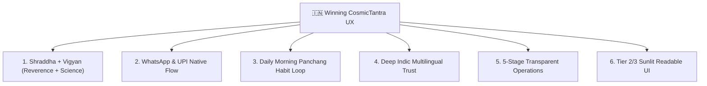

# 🇮🇳 How CosmicTantra Wins India: Visual, UX & Cultural Strategy

> **A Strategic Product & Interaction Design Framework for CosmicTantra (2026–2030)**
> *Written from the perspective of Principal Product Designer, Interaction Architect, and Cultural UX Researcher.*

---

## 📌 EXECUTIVE SUMMARY

In India, **Astrology (Jyotish) is not entertainment, horoscopes, or fortune-telling.** It is **Decision-Support Software** embedded into the cultural OS of 1.4 billion people.

Existing market leaders (*AstroTalk, InstaAstro, AstroSage*) operate on a **commoditized call-center model** ("Talk to Astrologer at ₹20/min"). This creates high anxiety, transactional distrust, fear-based upsells, and fragmented user experiences.

**CosmicTantra's Winning Strategy** is to position itself as the **Vedic Intelligence System of Record**:
1. **Unassailable Mathematical Authority** (Sidereal Ephemeris + Lahiri Ayanamsha)
2. **Sacred Varanasi Cultural Lineage** (Verified Scholars from Man Mandir Ghat & Haridwar)
3. **Radical Transparent Operations** (5-Stage Case Delivery + ₹199 Fixed Written Reports)
4. **Seamless Indic Native Experience** (WhatsApp integration + UPI 1-Tap + Multilingual UI)

---

## 🏛️ THE 6 CULTURAL & UX PILLARS TO WIN INDIA



---

### PILLAR 1: **"Shraddha" (Reverence) Meets "Vigyan" (Science)**

#### The Insight:
Indian users reject astrology apps that look like generic SaaS dashboards (dark blue grids) OR cheap superstitious websites (neon yellow banners with superstitious claims). The aesthetic must feel like entering a sacred **18th-century stone Jantar Mantar observatory at dawn**.

#### Visual Design Rules:
- **Color Palette**:
  - **Subah-e-Banaras (Day)**: Warm Sandstone `#FAF7F2`, Ganga Clay `#F2ECDE`, Temple Brass `#826315`, Terracotta `#A6461D`.
  - **Kashi Sandhya (Night)**: Deep Cosmic Obsidian `#07080C`, Temple Gold `#D4AF37`, Diya Amber `#E29A48`, Royal Indigo `#4848A8`.
- **Typography**:
  - *Cinzel / Outfit*: Editorial serif for sacred headings (`SEE THE SKY BEHIND THE NUMBERS`).
  - *JetBrains Mono*: Data precision font for astronomical coordinates (`Lahiri Ayanamsha 24°11'04"`).
  - *Inter / Noto Sans*: High-contrast body for multi-lingual Indic scripts.
- **Sensory Touchpoints**:
  - Subtle audio feedback (`chitiSensory.playTick()` brass bell frequency) on button taps.
  - Cinematic background video / images of Kashi Ghats & Man Singh Observatory.

---

### PILLAR 2: **WhatsApp & UPI Native Growth Engines**

#### The Insight:
In India, **WhatsApp is the Web** and **UPI (PhonePe, GPay, Paytm) is the Register**. Forcing users to download a heavy 80MB app or register with passwords causes 70%+ drop-off.

#### Product UX Strategy:
1. **1-Tap WhatsApp Kundali Share**:
   - Every generated Janma Kundali & Dasha summary has a prominent button: **"Family WhatsApp Par Bhejein"** (Share to Family Group).
   - Generates a beautifully formatted WhatsApp card image + link.
2. **Instant UPI Checkout (₹199)**:
   - Zero-registration checkout. User enters Name, Birth Details, and taps **Pay via PhonePe / GPay**.
   - Consultation status updates sent directly to WhatsApp!

---

### PILLAR 3: **The Daily Morning Panchang Habit Loop**

#### The Insight:
Over 60% of Indian households check the day's **Panchang (Tithi, Nakshatra, Rahu Kaal, Abhijit Muhurat)** every morning between 6:00 AM and 8:30 AM before making financial, travel, or career decisions.

#### Habit Architecture:
- **Subah Ka Panchang Widget**:
  - Displayed front-and-center on the homepage: **Rahu Kaal today**, **Abhijit Muhurat today**, **Tithi today**.
- **Daily WhatsApp Morning Digest**:
  - Users can subscribe to get their local city's auspicious windows sent automatically to WhatsApp every day at 6:30 AM.

---

### PILLAR 4: **Indic Multilingual First (ENG + हिन्दी + मराठी + தமிழ்)**

#### The Insight:
English is only used by ~10% of India's population. When making personal life decisions, 90%+ of users prefer reading in **Hindi, Marathi, Telugu, Tamil, Gujarati, or Bengali**.

#### Localization Blueprint:
- **Language Switcher in Header**:
  - Always visible `[ENG | हिन्दी]` button in top navigation bar.
- **Natural Cultural Phrasing (Not Robotic Translation)**:
  - *English*: "Auspicious Timing" $\rightarrow$ *Hindi*: "शुभ मुहूर्त" (Shubh Muhurat)
  - *English*: "Current Planetary Period" $\rightarrow$ *Hindi*: "आपकी वर्तमान महादशा" (Aapki Vartaman Mahadasha)
  - *English*: "Consult Scholar" $\rightarrow$ *Hindi*: "काशी के विद्वान ज्योतिषी से पूछें"

---

### PILLAR 5: **Radical Operational Transparency (5-Stage Pipeline)**

#### The Insight:
Users are tired of fake AI chatbots generating generic horoscopes or unethical astrologers selling ₹50,000 "remedy pujas".

#### The Trust Pipeline:
```
[1. Sidereal Calculation (±0.01°)] 
    ↓ 
[2. Chart & Dasha Generation] 
    ↓ 
[3. Verified Scholar Audit (Varanasi / Haridwar)] 
    ↓ 
[4. Signed Written Report Delivered] 
    ↓ 
[5. Immutable Vault Archive]
```
- Show the **Practitioner Directory** with real scholar photos, degrees (BHU Varanasi Sanskrit Vidya Peeth), and video introductions.
- Guarantee: **Fixed ₹199 Written Consultation** with 0 hidden upsells.

---

### PILLAR 6: **Mobile-First & Sunlight Readable (Tier 2/3 Optimization)**

#### The Insight:
Millions of users view the site outdoors under bright sunlight on entry-level Android devices (Redmi, Realme, Samsung Galaxy M).

#### Technical Guidelines:
- **Sunlight Readability (Subah-e-Banaras Light Mode)**:
  - Background `#FAF7F2` with ultra-high contrast text `#181512` (WCAG AAA compliant > 12:1 contrast ratio).
- **Mobile Touch Geometry**:
  - Minimum touch target height: `44px` with ample padding.
  - Horizontal swipeable tabs for 9 Grahas and 27 Nakshatras.
- **Page Performance**:
  - Next.js 14 App Router static prerendering (Page Load < 1.5s on 4G).

---

## 🎯 RECOMMENDED UX ROADMAP

| Phase | Feature / UX Focus | Impact on Indian User Base |
|---|---|---|
| **Phase 1 (Immediate)** | Subah-e-Banaras Light Mode + High-Contrast 3D Sky | 100% Outdoor Sunlight & Accessibility |
| **Phase 2 (Short-term)** | 1-Tap WhatsApp Panchang & Kundali Share Card | 5x Viral Organic Growth in Family Groups |
| **Phase 3 (Mid-term)** | Multi-Indic Language Support (Hindi, Marathi, Gujarati) | Unlocks 90% Non-English Tier 2/3 Market |
| **Phase 4 (Long-term)** | Live Varanasi Temple Aarti Stream & Daily Choghadiya | Daily Recurring Active Users (DAU) |

---

> **Conclusion**: By combining **Mathematical Ephemeris Precision** with **Sacred Varanasi Cultural Reverence**, **WhatsApp Native Sharing**, and **Transparent Fixed-Price Written Consultations**, CosmicTantra will become India's most trusted Vedic Intelligence Platform.
