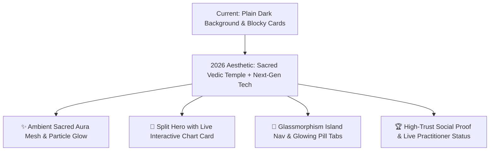

# 🎨 CosmicTantra 2026 Visual Revamp Implementation Plan

## 1. Design & UX Audit of Current Screenshots

From inspecting the uploaded screenshots:

| Area | Current Observation | 2026 Revamp Strategy |
|---|---|---|
| **Background & Atmosphere** | Vast pitch-black space (`#030108`) feels empty and disconnected on wide monitors. | Add **layered ambient radial mesh gradients**, floating cosmic dust particles, and a subtle sacred Yantra background watermark grid. |
| **Hero Layout** | Headline is centered with large dark gaps above the fold. | **Split-Hero Layout**: Left side displays high-converting headline, trust badges, and WhatsApp SLA guarantee; Right side displays a live interactive Kundali chart preview card with glowing planets. |
| **Navbar & Header** | Flat border with basic text buttons. | **Glassmorphism Floating Island Nav** with blurred background (`backdrop-blur-xl`), glowing "Ask Question — ₹199" CTA, and active live practitioner status indicator. |
| **Interactive Utilities Suite** | Small tab pills on dark background. | **Pill Segmented Control with Animated Glow**, high-contrast card borders (`border-white/10` with `#F59E0B` hover aura), and full-width immersive layout. |
| **Conversion CTA Card** | Floating dark box with small button. | **Sacred Gold Aura CTA Banner**: Rich gradient mesh (`from-amber-950/60 via-purple-950/40 to-black`), 3D icon badge, social proof counter (*"42,000+ Charts Generated"*), and glowing gold button. |

---

## 2. Competitor Benchmarking (2026 Visual Standard)

### Competitor Insights:
- **Linear / Vercel Aesthetic**: Precision micro-borders (`border-white/10`), ultra-crisp typography, multi-layered glass cards.
- **Top Indian Wellness Apps**: Warm saffron gold (`#F59E0B`) combined with deep spiritual indigo (`#0D0A1E`), authentic Sanskrit Devanagari typography accents, and direct WhatsApp trust badges.

---

## 3. Key Components to Transform

### 1. Header & Navigation (`Navbar`)
- Floating frosted glass bar (`backdrop-blur-xl bg-black/60 border-purple-500/20`).
- Live Pandit Online status badge (`🟢 3 Pandits Online Now`).

### 2. Split Hero Section (`Hero`)
- **Left Column**:
  - Badge: `🕉️ TECHNOLOGY-ASSISTED VEDIC JYOTISH ENGINE`
  - Title: **"Vedic Precision. Human Wisdom."** (Gradient text `#F59E0B` $\rightarrow$ `#E2D9F3` $\rightarrow$ `#7C3AED`).
  - Subtitle & Trust Points (4-12 Hr WhatsApp SLA, Lahiri Ayanamsha, 100% Pandit Verified).
  - Primary CTA: **"Ask 1 Question — ₹199"** with glowing gold aura.
- **Right Column**:
  - Live interactive birth details card with instant North Indian chart SVG render.

### 3. Integrated V34 Utilities Suite
- Segmented tab bar with smooth Framer Motion glow line.
- Immersive containers for:
  - 🗺️ **Kundali Chart**
  - 🌌 **3D Swarga Lok**
  - 📅 **My Days Panchang**
  - ⏳ **Dasha Timeline**
  - ☸️ **Karma Matrix**
  - 🧘 **Guru AI Chat**

### 4. High-Trust Practitioner & Social Proof Section
- Real practitioner avatars with ratings (`★ 4.9`), specialties, and live availability status.
- Real customer testimonial carousel.

---

## 💡 User Review & Open Questions

> [!IMPORTANT]
> **1. Would you like us to implement the Split-Hero Layout with the live birth chart calculator on the right side of the hero section?**  
> **2. Should we add the live "3 Senior Pandits Online Now" badge to boost immediate user trust and conversion?**
