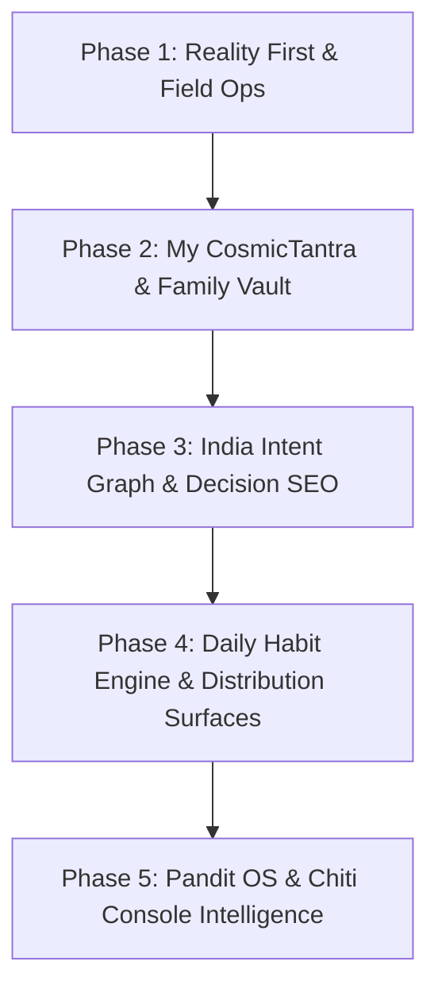

# 🏛️ CosmicTantra — Master Engineering & Product Improvement Plan
## Transforming CosmicTantra into India's Vedic Life-Intelligence Distribution Machine

> **Target Audience:** Incoming Senior Full-Stack Engineers, AI Agents, and Product Leads.  
> **System Scope:** `D:\Projects\Cosmic tantra AUGUST 2026`  
> **Baseline Core:** 74 Next.js routes compiled, 23/23 Playwright tests passing, 0 TypeScript errors, canonical Parashari Sidereal engine with Chitra Paksha Lahiri Ayanamsha, fail-closed auth, and DPDP PII protection.

---

## 🎯 Executive Strategy: The "Reality First" Moat

Competitors have built vast surfaces:
- **Drik Panchang:** 100,000+ cities astronomical utility.
- **AstroSage:** Broad horizontal scale, 9 languages, massive app footprint.
- **Astrotalk:** Instant marketplace transaction volume with 10,000+ generic astrologer listings.

**CosmicTantra's Asymmetric Advantage:**
We do **not** build an anonymous listing bazaar or opaque fortune-telling ads.  
We build **The Vedic Life-Intelligence System** — combining **inspectable astronomical calculation provenance**, **curated scholar practitioner authority (Banaras tradition)**, and a **continuous family graph habit loop**.

```
═══════════════════════════════════════════════════════════════════════════════════════════
                                THE 9 ACQUISITION & RETENTION LOOPS
═══════════════════════════════════════════════════════════════════════════════════════════
   HUMAN MOMENT               FREE PRODUCT               RETENTION LOOP         COMMERCIAL TRIGGER
 ───────────────────────────────────────────────────────────────────────────────────────────
 1. "What is today?"          Panchang / Rahu Kaal       7 AM Habit Briefing    None (Pure Utility)
 2. "When should I do this?"  Decision Muhurat Finder    Saved Date Window      Detailed Bespoke Muhurat
 3. "What does chart say?"    Kundali + Dasha River      Saved Birth Profile    Written Scholarly Folio
 4. "Will we match?"          36-Point Milan + Manglik   Couple Saved Profile   Marriage Decision Review
 5. "What is happening?"      Dasha / Gochara Alert      Personal Alert Sync    Ask Jyotishi
 6. "What should I name?"     Nakshatra Naam / Mulank    Shortlist Vault        Namkaran Consultation
 7. "Festival kab hai?"       Festival City Calculators  Calendar / ICS Sync    Puja / Samagri Counsel
 8. "I need an astrologer"    Practitioner Discovery     Follow Scholar         ₹199 Written Counsel
 9. "I trust this Pandit"     Searchable Utility Video   Subscribe / Revisit    Continuous Life CRM
═══════════════════════════════════════════════════════════════════════════════════════════
```

---

## 🏗️ Phase-by-Phase Implementation Roadmap



---

### 📍 PHASE 1: "Reality First" — Founding Pandit & Field Operations Loop

**Goal:** Ground the mathematical engine in live human operations before building more horizontal features.

#### 1.1 Field Milestones Checklist
- [ ] **Milestone 1.1: Founding Practitioner Onboarding (`/pandit/onboard/[token]`)**
  - Verify and onboard Pandit Ji (Varanasi / Banaras tradition) with authentic credentials, photo, tradition bio, and specialty tags.
- [ ] **Milestone 1.2: 10 End-to-End Test Consultations**
  - Generate 10 real-world customer inquiries covering Career, Marriage Milan, Business Timing, Health/Dasha, and Child Naming.
  - Pandit Ji reviews the calculation snapshot, edits the AI draft into authentic Sanskrit/Hindi scholarly guidance, and approves delivery.
- [ ] **Milestone 1.3: 5 Real ₹199 Razorpay Payments & Deliveries**
  - Execute 5 real monetary transactions via Razorpay UPI/Netbanking.
  - Verify automated delivery via WhatsApp template message & branded PDF email folio.
- [ ] **Milestone 1.4: Authentic Practitioner Video Assets (Searchable Utility Media)**
  - Record the first 3 short (2–5 min) utility explainers with Pandit Ji:
    1. *"Why Rahu Kaal changes across different cities"*
    2. *"Can Griha Pravesh happen during Chaturmas?"*
    3. *"What Saturn Mahadasha actually triggers for your Moon sign"*
  - Embed official YouTube streams into `/darshan` and respective `/library/*` articles.
- [ ] **Milestone 1.5: Zero Fake Social Proof Policy**
  - Eliminate all mock counters. Replace with *"Founding Practitioner: Pandit [Real Name], Banaras Tradition"* with verified credentials.

---

### 📍 PHASE 2: "My CosmicTantra" & Family Astrology Vault

**Goal:** Transition from anonymous single-session visitors to high-retention family chart custodians.

#### 2.1 Database Schema Additions (`prisma/schema.prisma`)
```prisma
model AstrologyCustomerProfile {
  id              String                  @id @default(uuid())
  projectId       String                  @default("cosmic-tantra")
  phone           String                  @unique
  name            String
  email           String?
  city            String?
  isVerified      Boolean                 @default(false)
  createdAt       DateTime                @default(now())
  updatedAt       DateTime                @updatedAt

  vaultMembers    AstrologyFamilyMember[]
  consultations   AstrologyConsultation[]
  calendarSyncs   AstrologyCalendarSync[]

  @@index([phone])
}

model AstrologyFamilyMember {
  id              String                   @id @default(uuid())
  profileId       String
  relation        String                   // SELF, SPOUSE, CHILD, MOTHER, FATHER, SIBLING, OTHER
  name            String
  gender          String?
  birthDate       DateTime
  birthTime       String
  birthCity       String
  birthLat        Float
  birthLon        Float
  timezone        Float                    @default(5.5)
  notes           String?
  
  // Stored Calculation Snapshot for instant hydration
  kundaliSnapshot Json?
  
  createdAt       DateTime                 @default(now())
  updatedAt       DateTime                 @updatedAt

  profile         AstrologyCustomerProfile @relation(fields: [profileId], references: [id], onDelete: Cascade)

  @@index([profileId])
}

model AstrologyCalendarSync {
  id              String                   @id @default(uuid())
  profileId       String
  syncToken       String                   @unique @default(uuid())
  subscribedCategories String[]            // EKADASHI, PURNIMA, AMAVASYA, PRADOSH, RAHU_KAAL, DASHA_SHIFTS
  lastFetchedAt   DateTime?
  createdAt       DateTime                 @default(now())

  profile         AstrologyCustomerProfile @relation(fields: [profileId], references: [id], onDelete: Cascade)
}
```

#### 2.2 Client-Side Hybrid Storage Pattern
- **Unauthenticated Users:** Zero friction. Store charts in `localStorage` via [`src/lib/profileStore.js`](file:///D:/Projects/Cosmic%20tantra%20AUGUST%202026/src/lib/profileStore.js) (Self, Spouse, Children, Parents).
- **Opt-in Phone Sync:** Enter mobile number + OTP $\rightarrow$ seamlessly hydrate `localStorage` into PostgreSQL `AstrologyFamilyMember` records.
- **Privacy & DPDP Compliance:** Provide a 1-click *"Delete All My Stored Family Records"* button invoking `DELETE /api/astrology/family/delete-all`.

---

### 📍 PHASE 3: The India Intent Graph & Decision Engine (High-Value SEO)

**Goal:** Own high-intent Indian life decisions rather than generic keyword clutter.

#### 3.1 Targeted Decision Intents
Instead of thin `/muhurat` directories, generate high-intent decision hubs:
1. `/muhurat/griha-pravesh/[city]/[year-month]`
2. `/muhurat/marriage/[city]/[year-month]`
3. `/muhurat/business-opening/[city]/[year-month]`
4. `/muhurat/property-registration/[city]/[year-month]`
5. `/muhurat/vehicle-delivery/[city]/[year-month]`
6. `/muhurat/bhoomi-pujan/[city]/[year-month]`
7. `/muhurat/naamkaran/[city]/[year-month]`
8. `/muhurat/annaprashan/[city]/[year-month]`
9. `/muhurat/mundan/[city]/[year-month]`
10. `/muhurat/gold-purchase/[city]/[year-month]`

#### 3.2 "Why This Time?" Inspectable Computation Proof
Every Muhurat page must contain an expandable **Inspectable Astronomical Proof Card**:
- ✅ **Auspicious Tithi**: *Shukla Paksha Panchami / Dashami*
- ✅ **Auspicious Nakshatra**: *Rohini / Uttara Phalguni / Anuradha*
- ✅ **Tara Bala & Chandra Bala**: *Calculated against local sunrise*
- ❌ **Prohibited Intervals Excluded**: *Rahu Kaal, Gulika Kaal, Yamaganda, Bhadra, and Rikta Tithis strictly filtered out*
- 🔍 **Calculation Record**: *CT Lahiri Engine v34, Chitrapaksha Ayanamsha, Local Coordinates & Ephemeris Timestamp*.

#### 3.3 Product Conversion Callout
```tsx
<div className="p-6 rounded-2xl bg-[#FAF7F2] dark:bg-[#0E1018] border border-[#D4AF37]/40">
  <h4>Planning your ceremony in {city}?</h4>
  <p>Our calculation engine has isolated 3 universal windows. To align these with your and your spouse's birth charts, request a personalized folio.</p>
  <button onClick={() => openBespokeMuhurat(intent, city)}>
    Find My Natal-Aligned Window (₹199) →
  </button>
</div>
```

---

### 📍 PHASE 4: Daily Habit Engine & Distribution Surfaces

**Goal:** Make CosmicTantra an indispensable morning ritual for millions of Indian households.

#### 4.1 Daily 7:00 AM Vedic Habit Briefing
- Combine Drik Panchang location utility with personal chart state:
  - **Local Panchang:** Sunrise, Sunset, Tithi, Nakshatra, Yoga, Karana, Rahu Kaal, Abhijit Muhurta, Shubh Choghadiya.
  - **For Your Chart Today:** Moon transit relative to natal Moon (Chandra Bala), active Mahadasha/Antardasha, and personal Tara Bala (Janma, Sampat, Vipat, Kshema, Pratyak, Sadhaka, Vadha, Mitra, Param Mitra).

#### 4.2 One-Click Calendar Sync (Google / Apple / Outlook ICS Feed)
- Subscribable endpoint: `/api/vedic-calendar/export?token=[userToken]`
- Real-time updates for:
  - Ekadashi, Pradosh, Purnima, Amavasya, Sankashti Vrats
  - Rahu Kaal daily alerts for current city
  - Major Dasha transitions (e.g. *Jupiter-Saturn Antardasha Entry*)

#### 4.3 WhatsApp Shareable Calculation Cards (Dynamic 9:16 Visuals)
- Create dynamic Edge OG image generation endpoint `/api/og/daily-panchang?city=Dhanbad&date=2026-08-25`
- Generate clean, beautifully typographed 9:16 WhatsApp status / group sharing cards with:
  - Today's Tithi, Nakshatra, Rahu Kaal, Abhijit
  - City sunrise/sunset
  - Verified by CosmicTantra badge
  - One-tap WhatsApp Share button with pre-filled message: *"☀️ आज का वैदिक पंचांग — धनबाद | CosmicTantra"*

---

### 📍 PHASE 5: Pandit OS & Chiti Console Intelligence Engine

**Goal:** Turn CosmicTantra into a complete operating system for verified Vedic scholars and a growth brain for Chiti Console.

#### 5.1 Triage-First Consultation Architecture
Before prompting for ₹199:
1. User enters question category (`Career`, `Marriage`, `Muhurat`, `Remedies`, `Education`).
2. System evaluates inquiry:
   - **Informational / Deterministic Query:** (e.g., *"What is my active Dasha?"* or *"When is Rahu Kaal today?"*) $\rightarrow$ **Answer instantly for FREE**.
   - **Complex Life Decision:** (e.g., *"Should I resign from my job during Rahu Dasha?"* or *"Matching charts with Manglik affliction"*) $\rightarrow$ **Route to Senior Scholar Review (₹199)**.
3. Building genuine trust by providing free answers for simple queries maximizes conversion for deep life questions.

#### 5.2 Consultation Memory & 90-Day Follow-Up Loops
- In `AstrologyConsultation`:
  - Store `decisionWindow` (e.g. `OCT_2026_TO_JAN_2027`)
  - Store `followUpDate` (e.g. 90 days post-delivery)
- Automated polite revisit notification:
  *"Pandit Ji had suggested reviewing your career planetary transits after the Jupiter ingress this month. Would you like to revisit your chart?"*

#### 5.3 Full-Funnel Analytics Instrumentation in Chiti Console
Track the entire lifecycle from acquisition to repeat:
```
SEARCH_QUERY 
  → LANDING_PAGE_VIEW 
  → UTILITY_CALCULATED 
  → BIRTH_CHART_STORED 
  → TRIAGE_QUESTION_STARTED 
  → PAYMENT_INITIATED (Razorpay) 
  → SIGNATURE_VERIFIED 
  → PANDIT_ASSIGNED 
  → AI_DRAFT_VERIFIED_BY_SCHOLAR 
  → REPORT_DELIVERED (WhatsApp/PDF) 
  → REVIEW_RATED 
  → RESULT_SHARED_WHATSAPP 
  → REPEAT_CONSULTATION
```

---

## 🔒 Verification & Compliance Standards for All Future Pull Requests

Any engineer or agent implementing items from this plan must satisfy the following strict release criteria:

1. **Deterministic Parity:** Any calculation changes must pass `npx playwright test tests/astrology.spec.ts` with 100% agreement against canonical Lahiri algorithms.
2. **Feature Integrity:** All new tools must have companion tests in `tests/features.spec.ts`.
3. **Responsive Invariance:** All new pages must pass `tests/responsive.spec.ts` across 320px, 360px, 375px, 390px, 412px, 430px, 768px, 1024px, and 1440px with **0px horizontal overflow**.
4. **Fail-Closed Security:** No hardcoded secrets. All authentication must fail closed in production with constant-time signature verification.
5. **Zero TypeScript Errors:** `npx tsc --noEmit` and `npm run build` must compile cleanly with exit code 0.
6. **DPDP Compliance:** Customer phone numbers and emails must never be rendered or transmitted without authorization.

---
*Authored & Verified for CosmicTantra Engineering Repository — August 2026*
