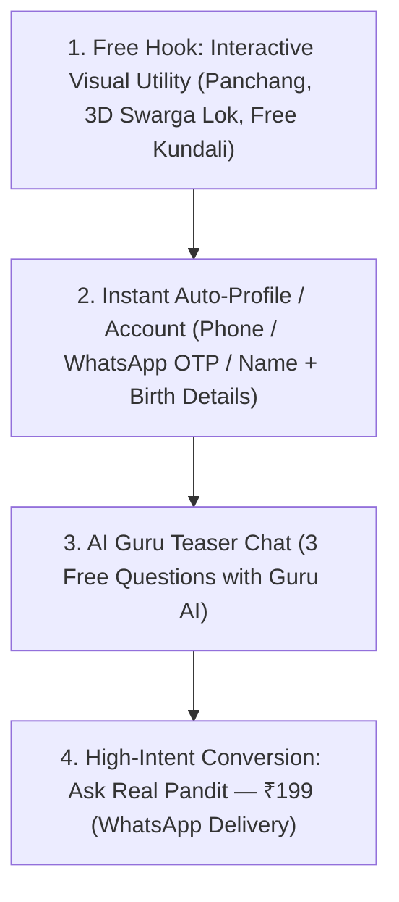

# 🪔 CosmicTantra — The Varanasi Growth Strategy & Competitor Analysis

> **Role**: Indian Product & Marketing Genius from Varanasi  
> **Mission**: Transform CosmicTantra into India’s most trusted, high-converting, tech-enabled astrology platform by combining **V34’s free interactive visual utilities** with **verified real Pandit consultations**.

---

## 1. Deep Competitor Analysis: Indian Big Players

| Competitor | Business Model | Strengths | Major Weaknesses & Vulnerabilities | CosmicTantra Opportunity |
|---|---|---|---|---|
| **Astrotalk** | Per-minute chat/call (₹20–₹200/min) | Massive influencer marketing, high impulse trial, large agent network | High user anxiety/distrust, pushy upsells, variable Pandit quality, zero auditability | **Fixed Price Transparency (₹199)**, **Deterministic Calculation Transparency**, **Human-Verified Provenance** |
| **AstroYogi** | B2B marketplace + per-minute phone calls | Strong brand heritage, enterprise partnerships | Outdated Web 2.0 UI/UX, clunky mobile web experience | **Modern Atmospheric Glassmorphism UI**, **Interactive 3D Swarga Lok & Charts** |
| **InstaAstro** | Low-ticket call packages (₹99–₹299) | Fast onboarding, high WhatsApp retargeting | Generic bot replies, lack of deep natal chart visualizers | **Free Instant Interactive Kundali & Vimshottari Dasha Engine** |
| **GaneshaSpeaks** | Written reports + per-minute calls | High organic SEO traffic, traditional authority | Extremely slow report turnaround (24-48 hrs), expensive written packages (₹500+) | **4-to-12 Hour SLA**, **AI-Drafted + Pandit-Approved Written Reports** |

### 💡 Core Takeaways from Competitors:
1. **Call per minute creates anxiety**: Users feel rushed, money ticks away, and they leave unsure.
2. **Lack of visual proof**: Users never see their actual Kundali or calculation engine during a live call.
3. **CosmicTantra’s Winning Edge**:
   - **Visual Superiority**: 3D Navgraha (Swarga Lok), Interactive North/South Indian charts, Karma Wheel, and Soul Matrix.
   - **Fixed-Price Trust**: **₹199 Ask One Question** (Written report delivered on WhatsApp).
   - **Auditability**: Complete calculation snapshot + AI draft + Pandit verification record.

---

## 2. The Customer Onboarding & Conversion Funnel

### The Problem in Current Setup:
> *"Before people talk to a real guru they need info, they need account right???"*

Currently, a new visitor arrives, tries the free calculator, but has no persistent profile. When they decide to ask a question, they have to re-enter their birth details!

### The Market-Ready 4-Step Funnel:

#### Step 1: Free Hook (No Login Required)
- Visitor lands on `cosmictantra.chiti.tech`.
- Immediately sees **Today's Panchang**, **3D Swarga Lok (Navgraha Orbit)**, and **Instant Birth Details Preview**.

#### Step 2: Frictionless Auto-Account Creation
- On entering birth details (Name, DOB, Time, City, WhatsApp Number):
  - System automatically creates an account/profile saved in `localStorage` & database.
  - Generates a **Personal Cosmic ID** (`CT-8892`).
  - All birth chart data, planetary positions, and Dasha periods are cached to their profile.

#### Step 3: AI Guru Teaser Chat (The Trust Builder)
- Visitor gets **3 Free Questions** with **Guru AI** (our LLM Jyotish Assistant).
- Guru AI answers using their calculated natal chart context:
  - *“Namaste Rahul! I see your Moon is in Vishakha Nakshatra and Rahu Dasha is active. Ask me anything about your current planetary phase.”*
- When the user asks a complex/life-changing question:
  - Guru AI provides a working insight, then gracefully prompts:  
    👉 *“For deep personal guidance and authentic Vedic remedies on this critical decision, consult Senior Pandit Ramesh Sharma (Verified Jyotish Practitioner) for ₹199.”*

#### Step 4: 1-Click ₹199 Consultation Checkout
- Birth details and question are automatically pre-filled from their session.
- 1-click Razorpay / UPI checkout.
- Order is submitted to Pandit Workspace for human verification & WhatsApp delivery!

---

## 3. Integrating V34 Cool Free Features into CosmicTantra August 2026

We already have 10 incredible V34 components in `CosmicTantra-main`! Here is how we integrate them into `D:\Projects\Cosmic tantra AUGUST 2026`:

1. **🌌 3D Swarga Lok (`SwargaLok.jsx`)**:
   - Interactive 3D Canvas visualizer showing real-time 9 Navgraha planet orbits around the Sun.
   - High visual "WOW factor" for landing page header.

2. **☸️ Karma Wheel (`KarmaWheel.jsx`) & 🪬 Soul Matrix (`SoulMatrix.jsx`)**:
   - Visual breakdown of 12 Houses, Karmic debts, and Life Path Dharma.

3. **⏳ Vimshottari Destiny Timeline (`DestinyTimeline.jsx`)**:
   - Visual interactive timeline highlighting Marriage, Wealth, and Career golden periods.

4. **🧘 Guru AI Chat (`ChatBox.jsx`)**:
   - Multilingual AI chat assistant integrated into customer dashboard.

---

## 4. Proposed Action Plan (Slices F & G)

### Slice F: Free Interactive V34 Utilities & Auto-Account Profile
- Integrate `SwargaLok.jsx` (3D Navgraha), `KarmaWheel.jsx`, `DestinyTimeline.jsx`, and `ChatBox.jsx` into the public customer experience.
- Add local & database profile persistence (`AstrologyCustomerProfile`).
- Implement 3 Free AI Guru questions teaser limit.

### Slice G: Market-Ready Conversion & Pandit Direct Handoff
- 1-click "Escalate to Real Pandit (₹199)" button directly inside AI Guru chat and Dasha timeline.
- Auto-fill customer birth details from profile.
- Razorpay / UPI payment integration with instant SMS/WhatsApp status tracking.

---

## 💡 User Decision & Review Required

> [!IMPORTANT]
> **Should we proceed to implement Slice F (integrating 3D Swarga Lok, AI Guru Chat, and Auto-Profile persistence into `D:\Projects\Cosmic tantra AUGUST 2026`)?**
