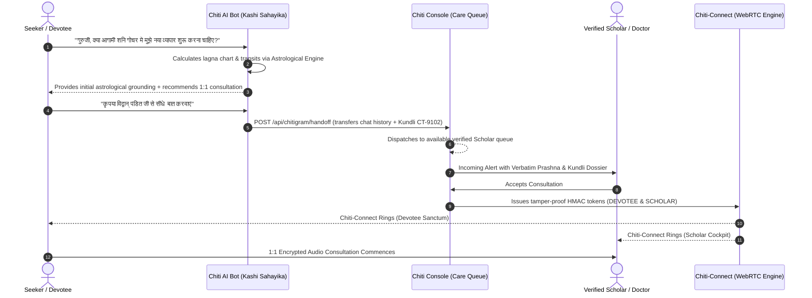

# CHITIGRAM — Realtime Communications & Contextual Business Action Protocol
**Specification Version:** 1.0.0-PROD  
**Author:** Chiti Technologies Architecture Group  
**Status:** Approved Architectural Standard  
**Companion Framework:** Chiti-Connect (Native WebRTC Audio/Video Transport)  

---

## 1. Executive Summary & Vision

### 1.1 Beyond the "Dumb Pipe" Paradigm
Conventional messengers (Telegram, WhatsApp, Signal) are **dumb message pipes**: they transport opaque strings between `User A` and `User B`. They are structurally blind to the underlying business transaction.

When a seeker talks to an astrologer, a patient talks to a physician, or a customer orders from a local shopkeeper, a traditional messenger forces fragmented, error-prone user context switching:
* Leaving the app to pay on UPI / PhonePe and uploading screenshot receipts.
* Manually re-typing birth times, symptoms, or delivery addresses.
* Losing consultation records, Lagna notes, and clinical prescriptions in endless chat histories.

### 1.2 The Chitigram Thesis
> **Chitigram is the Actionable Business Operating Mesh for the Chiti Ecosystem.**  
> Its atomic unit is not a message. It is **`Conversation + Context + Action + AI Escalation`**.

```
                           CHITI CONSOLE (ERP & Ops)
                                      │
                        ┌─────────────┴─────────────┐
                        ▼                           ▼
                   CHITIGRAM                    CHITI AI
            (Actionable Mesh & Bus)     (Intelligence & Copilot)
                        │                           │
                        └─────────────┬─────────────┘
                                      │
                   ┌──────────────────┼──────────────────┐
                   ▼                  ▼                  ▼
              COSMIC TANTRA       BAZAARSETU          CHITI HMS
              • Seeker ↔ Pandit   • Buyer ↔ Vendor   • Patient ↔ Doctor
              • Kundli Card       • Order/Cart Card  • Prescription Card
              • ₹501 Dakshina     • UPI Settlement   • Clinical Record
                                      │
                                      ▼
                                CHITI-CONNECT
                    (Native WebRTC VoIP • SIP • DTLS-SRTP)
```

---

## 2. Structural Separation: Chitigram vs. Chiti-Connect

To avoid architectural entanglement, the codebase enforces strict layer boundaries:

| Layer | System Name | Responsibility | Key Invariants |
|---|---|---|---|
| **L1: Engine** | **Chiti-Connect** | Low-level WebRTC peer connection, STUN/TURN traversal, DTLS-SRTP audio/video encryption, live soundwave visualizers, call control docks. | **VOICE_INV_001** (Zero media recording), ephemeral in-memory buffers, sub-100ms latency. |
| **L2: Bus** | **Chitigram** | Persistent conversation threads, unified multi-persona identities, message delivery state (`SENT`, `DELIVERED`, `READ`), contextual business cards, and native call trigger. | State durability, audit integrity, idempotency, cross-origin security. |

---

## 3. The 4-Tier Bot-to-Human Handoff Architecture

Chitigram standardizes the automated bot-to-expert escalation pattern across all verticals:



---

## 4. Context & Action Protocol (CAP) — Interactive Card Schemas

Chitigram messages support typed JSON payloads rendering native, interactive widgets in both mobile and desktop views:

### 4.1 `KUNDLI_INSIGHT_CARD` (CosmicTantra)
```json
{
  "type": "CONTEXT_CARD",
  "cardType": "KUNDLI_INSIGHT",
  "data": {
    "chartId": "CT-KUNDLI-78219",
    "nativeName": "अनुराग बाजपेयी",
    "ascendant": "Sagittarius (धनु)",
    "moonSign": "Pisces (मीन)",
    "nakshatra": "Revati-2",
    "activeDasha": "Guru-Surya (गुरु-सूर्य)",
    "verbatimQuestion": "व्यापार में नया निवेश और आगामी गोचर",
    "viewActionUrl": "/kundli?id=CT-KUNDLI-78219"
  }
}
```

### 4.2 `DAKSHINA_PAYMENT_CARD` (Financial Settlement)
```json
{
  "type": "ACTION_CARD",
  "cardType": "DAKSHINA_PAYMENT",
  "data": {
    "consultationId": "CT-SABHA-2026-1A04E304",
    "amountInr": 501,
    "currency": "INR",
    "beneficiaryScholar": "पं. रामकृष्ण त्रिपाठी",
    "entitledMinutes": 15,
    "paymentStatus": "PENDING",
    "upiIntentUrl": "upi://pay?pa=chititech@bank&am=501&pn=CosmicTantra"
  }
}
```

---

## 5. Security & Invariant Rules
1. **Zero Media Storage**: No recordings of WebRTC buffers are ever persisted to disk or cloud.
2. **Cryptographic Role Authorization**: Only signed HMAC session tokens dictate whether a user is an Expert or a Seeker.
3. **DTLS-SRTP E2EE**: Audio/video streams run peer-to-peer encrypted.
