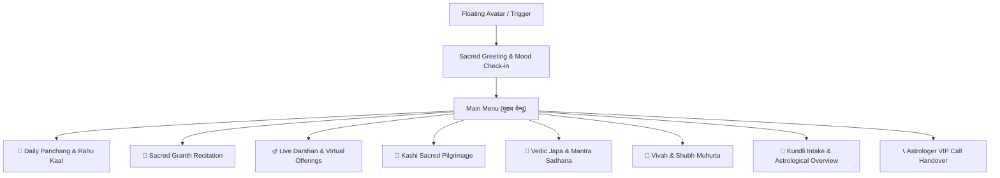

# Kashi Sahayak (काशी सहायक) — Master Flow & Capabilities Reference
## Complete Architectural Guide, Conversational State Machine & Sacred Handover Flows

---

## 1. Sacred Identity & Core Philosophy

**Kashi Sahayak (काशी सहायक)** is designed not as a generic corporate chatbot, but as an **empathic, spiritually grounded, Vedic companion** rooted in the eternal traditions of Kashi (Varanasi).

### Key Architectural Pillars
- **Sacred Greeting**: Always opens with *"हर हर महादेव! जय माँ तारा! 🙏"*
- **Two-Layer Cognition Boundary**:
  - **Deterministic Vedic Intelligence**: Panchang calculations, ephemeris mathematics, Dasha timelines, and Muhurta windows are calculated using strict astronomical algorithms (Lahiri Ayanamsha) — never hallucinated by an LLM.
  - **Empathic Conversational Layer**: Warm, respectful Hindi/Bilingual dialogue powered by emotional intelligence and classical scripture citation.
- **Human Scholar Handover**: Recognizes the sacred boundary where AI guidance transitions into authentic human scholarship (काशी विद्वत् परिषद् / पं. विद्यानंद शास्त्री).

---

## 2. Interactive Navigation Architecture & The "Main Menu"

Seekers can access Kashi Sahayak via the floating avatar button on any page. To ensure seekers never get stuck in deep sub-dialogues, a persistent **Main Menu (`🏠 मुख्य मेन्यू`)** allows instant reset.



---

## 3. Detailed Flow-by-Flow Specifications

### Flow 1: Sacred Mood & Emotional Check-in (भाव-संवेदन)
- **Trigger**: Seeker opens Kashi Sahayak or clicks "मन की बात कहें".
- **Options Displayed**:
  - `🌿 शान्त (Calm)`
  - `⚡ व्याकुल / चिन्तित (Anxious)`
  - `🌧️ उदास / निराश (Sad)`
  - `🔥 क्रुद्ध (Frustrated)`
  - `🌀 असमंजस में (Confused)`
  - `💤 थका हुआ (Fatigued)`
- **Behavior**:
  1. Acknowledges the emotional state with profound empathy.
  2. Dynamically pulls an authentic, uplifting shloka from scripture (Gita, Ramcharitmanas, or Upanishads).
  3. Speaks the verse aloud in Hindi with soothing intonation.
  4. Displays capability chips leading to practical spiritual remedies.

---

### Flow 2: Daily Panchang & Real-Time Rahu Kaal (दैनिक पञ्चाङ्ग)
- **Trigger**: "आज का पंचांग", "राहुकाल कब है?", "आज की तिथि", or tapping `📅 आज का पञ्चाङ्ग`.
- **Inputs**: Detected user location or default (Varanasi).
- **Data Displayed**:
  - Exact Date, Hindu Samvat, Weekday.
  - Tithi & Paksha (e.g., *शुक्ल पक्ष एकादशी*).
  - Nakshatra & Pada (e.g., *रोहिणी नक्षत्र, द्वितीय पद*).
  - Yoga & Karana.
  - **Live Rahu Kaal Alert**: Highlights if Rahu Kaal is currently active (`⚠️ सतर्कता वेला`) or upcoming, with clear advisory on delaying major financial agreements.
  - **Abhijit Muhurat**: Exact auspicious window for commencing auspicious actions.
- **Action Buttons**:
  - `📅 सम्पूर्ण मासिक पञ्चाङ्ग कैलेंडर` -> Routes to `/calendar`.
  - `🪔 काशी विश्वनाथ लाइव दर्शन` -> Triggers Darshan flow.
  - `🏠 मुख्य मेन्यू` -> Returns to top menu.

---

### Flow 3: Sacred Granth Recitation Flow (धर्मग्रन्थ पाठ व श्रवण)
- **Trigger**: "ग्रन्थ सुनना है", "गीता का पाठ", "रामायण सुनाओ", or tapping `📖 धर्मग्रन्थ पाठ सुनें`.
- **Conversational Prompt**: 
  > *"हर हर महादेव! 🙏 आप किस पावन ग्रन्थ का पाठ व भावार्थ सुनना चाहते हैं? नीचे से चयन करें:"*
- **Scripture Catalog Buttons**:
  1. **श्रीमद्भगवद्गीता (Bhagavad Gita)**: 18 Chapters, 700 Shlokas with Sanskrit pronunciation and Hindi translation.
  2. **श्रीरामचरितमानस (Ramcharitmanas)**: Bal Kanda, Ayodhya Kanda, Sundar Kanda, etc.
  3. **श्री शिव महापुराण (Shiva Mahapuran)**: Mahatmya, Rudra Samhita, Jyotirlinga origins.
  4. **श्रीमद् देवी भागवत (Devi Bhagavata)**: Shakti Mahatmya and 52 Shakti Peeth legends.
  5. **श्री हनुमान चालीसा (Hanuman Chalisa)**: Complete 40 chaupais with meaning and sankalpa.
  6. **श्री शिव ताण्डव स्तोत्रम् (Shiva Tandava Stotra)**: Powerful rhythmic stotra by Ravana.
  7. **महामृत्युंजय स्तोत्र व जप (Maha Mrityunjaya)**: Healing and longevity mantra.
  8. **श्री सूक्तम् व कनकधारा (Shri Suktam & Kanakadhara)**: Prosperity and Lakshmi blessings.
- **Playback Capabilities**:
  - **Synchronized Audio Narration**: Reads Sanskrit shloka followed by Hindi bhavarth at a dignified, meditative cadence (0.82x speed).
  - **Interactive Controls**: `▶️ पाठ जारी रखें`, `⏸️ विराम`, `⏩ अगला श्लोक`, `🏠 ग्रन्थ सूची`.
  - **Continuous Auto-Advance**: Server-tracked reading cursor preserves progress across sessions in `localStorage`.

---

### Flow 4: Live Temple Darshan & Virtual Offerings (प्रत्यक्ष दर्शन व अनुष्ठान)
- **Trigger**: "दर्शन", "विश्वनाथ जी", "सोमनाथ दर्शन", or tapping `🪔 लाइव दर्शन`.
- **In-Chat Shrine Card**:
  - Direct HD video sanctum stream of selected shrine (Kashi Vishwanath, Mahakaleshwar, Somnath, Kedarnath, etc.).
  - Temple shloka, deity details, and live aarti timings.
- **Interactive Ritual Actions**:
  - 🪔 **दीपदान (Offer Diya)**:
    - Triggers `chitiSensory.playDiya()`: Soft ignition whoosh followed by warm flickering harmonic.
    - Illuminates glowing golden diyas on the interface border with flame pulse animation.
    - Confirmation: *"दीपदान प्रज्वलित ✓ प्रभु आपके जीवन को ज्ञान व शान्ति से आलोकित करें।"*
  - 🌸 **पुष्प अर्पण (Offer Flowers / Pushpanjali)**:
    - Triggers `chitiSensory.playFlowerDrop()`: Shimmering bell drop acoustic.
    - Triggers falling flower petal animation cascading over the sanctum view.
    - Confirmation: *"पुष्प अर्पित ✓"*
  - 🔔 **घण्टी (Temple Bell)**: Rings sacred 880 Hz temple bell.
  - 🐚 **शंख (Sacred Conch)**: Blows resonant 220 Hz Shankha sound.
- **Action Buttons**:
  - `🌸 २६ महातीर्थ दर्शन कक्ष खोलें` -> Routes to full `/darshan` sanctuary.
  - `🏠 मुख्य मेन्यू` -> Returns to menu.

---

### Flow 5: Kashi Sacred Pilgrimage Guide (काशी पावन यात्रा)
- **Trigger**: "काशी यात्रा", "वाराणसी दर्शन", "बनारस घूमना है", or tapping `🚩 काशी यात्रा योजना`.
- **Content Delivered**:
  - **Panch-Tirtha Itinerary**: Order of visiting Kashi Vishwanath, Annapurna, Kal Bhairav (Kotwal of Kashi), Sankat Mochan, and Vishalakshi Shakti Peeth.
  - **Ganga Aarti Timings**: Morning Subah-e-Banaras (Assi Ghat) and Evening Maha Aarti (Dashashwamedh Ghat).
  - **Sacred Boat Pilgrimage**: Sunrise boat route from Assi to Manikarnika.
- **Action Buttons**:
  - `📅 यात्रा हेतु शुभ मुहूर्त पञ्चाङ्ग` -> Opens calendar.
  - `📜 काशी के विद्वान् से संकल्प कराएं` -> Opens consultation.

---

### Flow 6: Vedic Japa & 108 Bead Digital Mala (जप व साधना)
- **Trigger**: "जप करना है", "माला", "मन्त्र साधना", or tapping `📿 डिजिटल जप माला`.
- **Content Delivered**:
  - Displays selected mantra in pure Devanagari with transliteration and spiritual significance.
  - Integrated **Digital 108 Japa Counter**: Tap to increment bead count with subtle haptic tap (`vibrate(8)`) and tick feedback.
  - Automatic Sankalpa completion at 108 beads.
- **Action Buttons**:
  - `📿 सम्पूर्ण जप ट्रैकर खोलें` -> Routes to `/remedy-tracker`.

---

### Flow 7: Shubh Muhurta & Manglik Guidance (शुभ मुहूर्त)
- **Trigger**: "शादी का मुहूर्त", "विवाह", "गृह प्रवेश", "नामकरण".
- **Content Delivered**:
  - Upcoming verified candidate dates based on Drik Ganita and Muhurta Chintamani.
  - Star ratings (⭐⭐⭐⭐⭐ सर्वोत्तम, etc.) based on Tithi, Nakshatra, and Chandra Gochar.
  - Classical advisory on Astakoota matching and Tribala Shuddhi.
- **Action Buttons**:
  - `💍 ३६-गुण कुण्डली मिलान करें` -> Routes to `/kundali-milan`.
  - `📜 विद्वान् ज्योतिषी से मुहूर्त निकलवाएं` -> Handover flow.

---

### Flow 8: Kundli Intake, General Overview & Consultation Handover

This is the core flagship flow where discovery transitions into value and consultation.

#### Step 8.1: Guided Intake Dialog
- Chatbot guides the seeker with natural language tolerance:
  1. **Name**: (e.g., "Rahul Sharma").
  2. **Birth Date**: Supports `1996-08-15`, `15/08/1996`, `15 अगस्त 1996`, with quick sample chips. Confirms before proceeding.
  3. **Birth Time**: Supports `10:30 AM`, `14:45`, `2.20`, `शाम 7 बजे`, with time-of-day sample chips.
  4. **Birth City**: Multi-token city search (e.g., `"Bilaspur, CG"` or `"पटना बिहार"`). Resolves exact coordinates and timezone.

#### Step 8.2: General Overview Presentation (Website Summary Parity)
- Chatbot performs ephemeris calculation and displays the **Astrological Pulse Overview Card**:
  - **Lagna (Ascendant)**: e.g., *वृषभ (Vrishabha)* with ruling planet Venus.
  - **Rashi & Nakshatra**: e.g., *कर्क (Cancer) • रोहिणी नक्षत्र (Rohini)*.
  - **Current Vimshottari Dasha**: e.g., *गुरु की महादशा में शनि की अन्तर्दशा (2024 - 2027)*.
  - **Gochar Transit Pulse**: Indicates whether today is a Power Window (*शुभ सिद्धि योग*) or Caution Window (*सतर्कता वेला*).
  - **Executive Life Strengths**: Highlights top dimension scores (e.g., *Artha 78/100, Vidya 82/100*).
- Voice reads this summary aloud so the seeker immediately hears their astrological identity.

#### Step 8.3: Two Primary Action Buttons
Immediately below the summary card, two large action buttons are presented:
1. **`📄 View Full Kundli / Download PDF (सम्पूर्ण कुण्डली देखें)`**:
   - Direct link to `/report`, passing the synchronized birth details.
2. **`📞 Talk to Astrologer (पंडित जी से बात करें)`**:
   - Opens the **VIP Concierge Consultation Modal**.

#### Step 8.4: VIP Concierge Consultation Modal & Dispatch
When "Talk to Astrologer" is selected, the modal clearly guides the user through the exact process:

```
┌─────────────────────────────────────────────────────────────┐
│ 🕉️ काशी विद्वत् परिषद् • वरिष्ठ ज्योतिषी परामर्श पत्र         │
├─────────────────────────────────────────────────────────────┤
│ पं. विद्यानंद शास्त्री (BHU ज्योतिषरत्न • ३५+ वर्ष अनुभव)      │
│                                                             │
│ 📞 CUSTOMER CARE HELPLINE: +91 9972934937                   │
│                                                             │
│ [ 📞 Call Customer Care Now ]   [ 💬 WhatsApp Dispatch ]     │
├─────────────────────────────────────────────────────────────┤
│ 📋 PAR परामर्श प्रक्रिया (How It Works):                      │
│                                                             │
│ 1️⃣ Call Customer Care: आपकी कॉल तुरंत केयर डेस्क से जुड़ेगी। │
│ 2️⃣ WhatsApp Payment Link: कॉल पर आपके WhatsApp पर ₹501       │
│    परामर्श लिंक भेजा जाएगा।                                 │
│ 3️⃣ Group Call with Pandit Ji: भुगतान होते ही पंडित जी को    │
│    ग्रुप कॉल पर जोड़ा जाएगा (१०-१५ मिनट विस्तृत व्याख्या)।     │
│ 4️⃣ PDF & Audio on WhatsApp: सम्पूर्ण कुण्डली ग्रन्थ PDF       │
│    एवं बातचीत की ऑडियो रिकॉर्डिंग ड्राइव लिंक WhatsApp पर।    │
│ 5️⃣ Regular Updates: भविष्य के गोचर व उपाय समय-समय पर प्राप्त│
│    होते रहेंगे।                                             │
└─────────────────────────────────────────────────────────────┘
```

- **Direct Call Link**: `<a href="tel:+919972934937">`
- **WhatsApp Click-to-Chat Link**: Pre-populates the seeker's details:
  > *"हर हर महादेव! 🙏 मेरा नाम [Name] है। जन्म विवरण: [Date], [Time], [City]। मुझे कुण्डली की व्याख्या हेतु पं. विद्यानंद शास्त्री जी से बात करनी है। कृपया ₹501 परामर्श लिंक भेजें।"*

---

## 4. Audio & Sensory Feedback Architecture

All sacred feedback is driven by programmatic Web Audio API synthesis in `src/lib/chitiAudio.js`:

| Sound Effect | Frequency / Synthesis | Spiritual Meaning |
| :--- | :--- | :--- |
| **Om Chant** (`playOmChant`) | 136.1 Hz Cosmic OM sine wave | Grounding, centering mind |
| **Temple Bell** (`playBell`) | 880 Hz fundamental + 440 Hz decay | Awaken divine consciousness |
| **Sacred Conch** (`playConch`) | 160 Hz -> 220 Hz sawtooth harmonic | Dispel negative energies |
| **Diya Ignition** (`playDiya`) | Low-pass filtered noise + 330 Hz flicker | Lighting sacred lamp (ज्ञान दीप) |
| **Flower Drop** (`playFlowerDrop`) | 1200 Hz -> 600 Hz shimmer decay | Pushpanjali (पुष्प समर्पण) |
| **Sacred Gong** (`playSacredGong`) | 108 Hz base + 216 Hz overtone | Deep meditation seal |

---

## 5. Potential Gaps & Missing Flows for User Review

The following areas are ready for user review and expansion:

1. **Customized Sankalpa Flow**: Adding a guided 3-step ritual where seekers enter their Gotra, Father's Name, and specific desire (मनोकामना) before starting Japa or Darshan.
2. **Kundali Milan Comparison Inside Chat**: Allowing a seeker to submit both Boy and Girl details inside Kashi Sahayak and receiving the 36-guna score directly in chat.
3. **Automated WhatsApp Follow-Up Webhook**: Connecting the call completion event to an automated CRM dispatch that delivers the Google Drive link and PDF without manual handling.
4. **Voice Input (Speech-to-Text)**: Adding a microphone button so Hindi-speaking devotees can speak their questions naturally to Kashi Sahayak.
