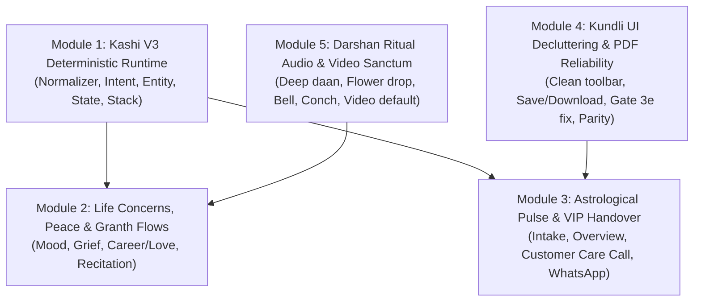

# Kashi Sahayak V3 & CosmicTantra Experience Overhaul
## Master Implementation Plan: Maximum Conversational Capability Without LLM, Kundli PDF Parity & UX Decluttering

---

## 1. Vision & Architectural Philosophy

### Core Tenet: The Best Deterministic Conversational Assistant Possible
Kashi Sahayak does not imitate an LLM. It operates on a **predictable, stateful, context-aware, multilingual, voice-friendly, emotionally considerate, and deterministic architecture** deeply connected to CosmicTantra's actual calculation engines.

```text
User Utterance (Text / Spoken Hindi)
    ↓
Language Normalizer (Spelling, Dialect, Transliteration, Stemming)
    ↓
Weighted Pattern Intent Matcher + Contextual Boost
    ↓
Entity Extractor (Dates, Times, Subjects, Locations, Grahas, Bhavas, Shrines)
    ↓
Conversation State & Flow Stack (Suspended flows, Open loops, Prior facts)
    ↓
Missing-Slot Resolver (Interactive chips & polite targeted prompts)
    ↓
Deterministic Capability Router (Panchang, Kundli, Granth, Darshan, Japa, Muhurta)
    ↓
Template Engine (Varied, respectful Hindi/Bilingual responses with depth levels)
    ↓
Next Best Action Engine (2–4 context-aware next chips, not generic menus)
    ↓
Voice Synthesis (0.82x meditative cadence) + Web Audio Sacred Synthesizers
```

**Intelligence Principle**: The user must feel they are having a natural, continuous conversation across 20+ turns, even though the underlying system is completely deterministic, transparent, and grounded in authentic Vedic truth.

---

## 2. Work Breakdown Structure (Modular Phases)

The implementation is structured into **5 distinct modules** that can be executed independently and tested systematically:



---

## 3. Module 1: Kashi V3 Deterministic Conversational Core

### 1.1 Language Normalizer
- **Target File**: `src/lib/kashi/v3/languageNormalizer.ts` [NEW]
- **Responsibilities**:
  - Normalize Devanagari variations, Hinglish phonetics, and common typos into canonical semantic tokens.
  - Examples:
    - `rahu kaal`, `rahukaal`, `राहु काल`, `राहुकाल`, `खराब समय` -> `TOKEN_RAHUKAAL`
    - `kundli`, `kundali`, `कुण्डली`, `कुंडली`, `जन्मपत्री`, `janam patri` -> `TOKEN_KUNDLI`
    - `shaadi`, `shadi`, `विवाह`, `शादी`, `marriage`, `biyah` -> `TOKEN_MARRIAGE`
    - `naukri`, `job`, `नौकरी`, `करियर`, `career`, `rozgar` -> `TOKEN_CAREER`
    - `dasha`, `दशा`, `mahadasha`, `antardasha`, `current dasha` -> `TOKEN_DASHA`
    - `darshan`, `दर्शन`, `aarti`, `आरती`, `mandir`, `temple` -> `TOKEN_DARSHAN`
    - `granth`, `ग्रन्थ`, `path`, `पाठ`, `recite`, `shloka`, `श्लोक` -> `TOKEN_GRANTH`

### 1.2 Categorized Intent Registry & Weighted Matcher
- **Target File**: `src/lib/kashi/v3/intentEngine.ts` [NEW]
- **Responsibilities**:
  - Implement 50+ deterministic intents across 8 domains:
    - **Navigation**: `OPEN_MAIN_MENU`, `GO_BACK`, `HELP`, `REPEAT_LAST`, `STOP_AUDIO`
    - **Panchang**: `GET_TITHI`, `GET_NAKSHATRA`, `GET_PAKSHA`, `GET_YOGA`, `GET_KARANA`, `GET_RAHUKAAL`, `GET_ABHIJIT`, `GET_SUNRISE`, `GET_FULL_PANCHANG`, `GET_TITHI_TRANSITION`
    - **Observances**: `NEXT_EKADASHI`, `NEXT_PURNIMA`, `NEXT_AMAVASYA`, `NEXT_PRADOSH`, `IMPORTANT_DAYS_NEAR_DATE`
    - **Kundli**: `CREATE_KUNDLI`, `GET_LAGNA`, `GET_MOON_SIGN`, `GET_NAKSHATRA_NATAL`, `GET_PLANET_POSITION`, `GET_BHAVA`, `GET_BHAVA_LORD`, `GET_CURRENT_DASHA`, `GET_NEXT_DASHA`, `EXPLAIN_DASHA`, `EXPLAIN_YOGA`, `EXPLAIN_BHAVA`
    - **Life Themes**: `CAREER_GUIDANCE`, `LOVE_GUIDANCE`, `MARRIAGE_GUIDANCE`, `FINANCE_GUIDANCE`, `EDUCATION_GUIDANCE`, `FAMILY_GUIDANCE`
    - **Spiritual & Peace**: `SEEK_PEACE`, `FEELING_ANXIOUS`, `FEELING_SAD`, `FEELING_CONFUSED`, `FEELING_ANGRY`, `START_JAPA`, `OPEN_DARSHAN`, `RECITE_SCRIPTURE`
    - **Pilgrimage**: `PLAN_KASHI_TRIP`
    - **Consultation**: `TALK_TO_PANDIT`, `CONSULTATION_PRICE`, `CONSULTATION_PROCESS`
  - **Weighted Scoring**:
    - Primary keyword: +10 pts
    - Secondary modifiers: +3 pts
    - Contextual boost (if current conversation is in domain): +6 pts
    - Sub-entity match: +4 pts
  - **Fallback Recovery**: Derives top 3 candidate categories based on partial scores; asks: *"मैं इसे ठीक से पहचान नहीं पाई। क्या आप इनमें से किसी विषय के बारे में पूछ रहे हैं?"*

### 1.3 Deterministic Entity Extractors
- **Target Files**:
  - `src/lib/kashi/v3/entityExtractors/temporalResolver.ts` [NEW]
  - `src/lib/kashi/v3/entityExtractors/subjectResolver.ts` [NEW]
  - `src/lib/kashi/v3/entityExtractors/jyotishEntityResolver.ts` [NEW]
- **Responsibilities**:
  - **TemporalResolver**:
    - Resolves relative terms: `"आज"`, `"कल"`, `"परसों"`, `"कल सुबह"`, `"आज शाम"`, `"अगले सोमवार"`, `"इस रविवार"`, `"5 सितंबर"`, `"अगली एकादशी"`.
    - Handles conversational pronouns: `"उस दिन"`, `"वही दिन"`, `"इसके अगले दिन"`, `"एक दिन पहले"`.
  - **SubjectResolver**:
    - Tracks active subjects: `SELF`, `PARTNER`, `CHILD`, `MOTHER`, `FATHER`, `PERSON_A`, `PERSON_B`.
    - Resolves possessive pronouns: `"उसकी"`, `"पत्नी की"`, `"मेरी वाली"`, `"बेटे की"`.
  - **JyotishEntityResolver**:
    - Identifies 9 Grahas (Sun..Ketu), 12 Rashis, 27 Nakshatras, 12 Bhavas (तनु..व्यय), and classical Yogas (Gajakesari, Hamsa, Budhaditya, etc.).

### 1.4 Stateful Conversation Stack & Open-Loop Recovery
- **Target File**: `src/lib/kashi/v3/conversationState.ts` [NEW]
- **State Schema**:
  ```typescript
  export interface KashiConversationState {
    activeSubject: 'SELF' | 'PARTNER' | 'CHILD' | 'MOTHER' | 'FATHER' | string;
    activeDate: string; // ISO date YYYY-MM-DD
    activeLocation: { name: string; lat: number; lng: number; tz: number };
    activeDomain: 'PANCHANG' | 'KUNDLI' | 'DARSHAN' | 'GRANTH' | 'PEACE' | 'CAREER' | 'RELATIONSHIP' | 'CONSULTATION';
    activeIntent: string;
    activeEntity?: { type: string; id: string; name: string; evidence?: any };
    previousIntent?: string;
    previousDomain?: string;
    pendingFlow?: {
      flowId: 'KUNDLI_INTAKE' | 'PILGRIMAGE_PLAN' | 'CONSULTATION_DISPATCH';
      missingSlot: 'birthDate' | 'birthTime' | 'birthCity' | 'name';
      collectedData: Record<string, any>;
    };
    conversationStack: Array<{ domain: string; intent: string; entity?: any }>;
    lastSpeakableText: string;
    detailLevel: 'SHORT' | 'NORMAL' | 'PANDIT';
    conversationPosture: 'UTILITY' | 'SEEKING_GUIDANCE' | 'SEEKING_PEACE' | 'DEVOTIONAL' | 'ANALYTICAL' | 'CONSULTATION_READY';
  }
  ```
- **Interruption & Resumption Handling**:
  - When a seeker interrupts intake (e.g. while being asked for birth time, asks *"आज राहुकाल क्या है?"*):
    1. Answer the Rahu Kaal question completely with exact timings.
    2. Suspend Kundli intake in `pendingFlow`.
    3. Conclude with gentle resume prompt: *"और जब चाहें, आपकी कुण्डली के लिए जन्म समय अभी बाकी है।"* + `[ 🕒 जन्म समय दर्ज करें ]` chip.
  - Support `"वापस"`, `"पहले वाली बात"`, `"कुंडली पर वापस"` by popping the stack.

### 1.5 Explainability Chains ("क्यों?", "मतलब?", "फिर?")
- For any delivered astrological or panchang fact, store `activeFact`.
- Support immediate follow-ups:
  - `"क्यों?"` -> Returns mathematical/astronomical rule definition (e.g. *Hamsa Yoga exists because Jupiter is in Pisces in the 7th Kendra house*).
  - `"मतलब?"` -> Returns human life implication.
  - `"कब तक?"` -> Returns Dasha or Gochar end date.
  - `"अच्छा या खराब?"` -> Returns balanced shastra assessment.
  - `"और बताओ"` -> Escalates from `SHORT` -> `NORMAL` -> `PANDIT` detail level.

---

## 4. Module 2: Life Concerns, Peace Domain & Sacred Granth Recitation

### 2.1 First-Class Life Themes & Emotional Care
- **Target File**: `src/lib/kashi/v3/lifeThemes.ts` [NEW]
- **Rule**: When a seeker expresses distress, heartbreak, or career panic, **never immediately force technical Jyotish onto them**.
- **Paths**:
  - **Career Worry** (*"मेरी नौकरी को लेकर बहुत चिंता है"*):
    - Acknowledge warmly: *"मैं समझ रही हूँ। आप किस बात को लेकर अधिक चिंतित हैं?"*
    - Contextual chips: `[ नौकरी जाने का डर ]` `[ नई नौकरी ढूँढनी है ]` `[ काम में तनाव ]` `[ कुण्डली से वर्तमान समय समझना ]`
  - **Relationship / Love Worry** (*"रिश्ते में बहुत परेशानी है"*):
    - Contextual chips: `[ झगड़े बढ़ गए हैं ]` `[ विवाह को लेकर अनिश्चित हूँ ]` `[ कुण्डली मिलान देखना है ]` `[ मन शांत करना है ]`
  - **Seeking Peace Domain** (*"मन बहुत खराब है"*):
    - Reassurance: *"मैं आपके साथ हूँ। अभी आप क्या चाहेंगे?"*
    - Non-intrusive paths: `[ 2 मिनट शांत बैठें ]` `[ महादेव का मंत्र सुनें ]` `[ गीता का एक श्लोक ]` `[ दर्शन करें ]` `[ मन की बात कहें ]`
  - **Varied Scripted Templates**: 15–20 approved variations per emotional state to prevent mechanical repetition without using generative models.

### 2.2 Scripture & Sacred Granth Recitation Flow
- **Target File**: `src/lib/kashi/v3/granthFlow.ts` [NEW]
- **Scripture Catalog**:
  1. `bhagavad-gita` (18 Chapters, 700 Shlokas with Sanskrit & Hindi translation)
  2. `ramcharitmanas` (7 Kandas: Bal, Ayodhya, Aranya, Kishkindha, Sundar, Lanka, Uttar)
  3. `shiva-mahapuran` (Mahatmya, Rudra Samhita, Jyotirlinga legends)
  4. `devi-bhagavata` (Shakti Mahatmya, Navadurga)
  5. `hanuman-chalisa` (40 Chaupais)
  6. `shiva-tandav-stotra` (Ravana Stuti)
  7. `mahamrityunjaya` (Healing & Longevity)
  8. `shri-suktam` (Lakshmi Stotra)
- **Recitation Controls**:
  - Continuous narration at 0.82x speed.
  - Active buttons: `[ ▶️ पाठ जारी रखें ]`, `[ ⏸️ विराम ]`, `[ ⏩ अगला श्लोक ]`, `[ 🏠 ग्रन्थ सूची ]`.

---

## 5. Module 3: Astrological Pulse & VIP Handover Pipeline

### 3.1 Kundli Intake & Overview Generation (Website Parity)
- **Target File**: `src/lib/kashi/v3/kundliFlow.ts` [NEW]
- **Flow**:
  1. Parse Name, Date, Time, City with tolerance for natural inputs (`"15/08/1996"`, `"10:30 AM"`, `"Bilaspur, CG"`).
  2. Compute Vedic chart using `getCanonicalJyotishSnapshot` and `computeExecutiveLifeDimensions`.
  3. Render **Astrological Pulse Card** in chat:
     - Lagna, Moon Rashi, Nakshatra.
     - Active Mahadasha & Antardasha.
     - Gochar Transit status: *Power Window (शुभ सिद्धि योग)* or *Caution Window (सतर्कता वेला)*.
     - Top Executive Life Dimension score.
  4. Voice synthesizes this summary immediately.

### 3.2 Two Primary Action Buttons
- Immediately following the overview card, render:
  - **`📄 View Full Kundli / Download PDF (सम्पूर्ण कुण्डली देखें)`** -> Routes to `/report`.
  - **`📞 Talk to Astrologer (पंडित जी से बात करें)`** -> Opens VIP Concierge Modal.

### 3.3 VIP Concierge Consultation Modal & Dispatch
- **Target File**: `src/components/consultation/VIPConsultationModal.tsx` [NEW]
- **Hotline & Dispatch Specifications**:
  - Canonical Customer Care Helpline: **`+91 9972934937`**
  - Direct call button: `<a href="tel:+919972934937">`
  - WhatsApp Click-to-Chat button: `https://wa.me/919972934937` with auto-filled message:
    > *"हर हर महादेव! 🙏 मेरा नाम [Name] है। जन्म विवरण: [Date], [Time], [City]। मुझे कुण्डली व्याख्या हेतु पं. विद्यानंद शास्त्री जी से बात करनी है। कृपया ₹501 परामर्श लिंक भेजें।"*
  - **ScholarHandoverPacket**: Generates a compact JSON summary passed to WhatsApp/CRM:
    ```typescript
    export interface ScholarHandoverPacket {
      seekerName: string;
      birthDetails: { date: string; time: string; city: string; lat: number; lng: number };
      primaryConcern: string;
      lagna: string;
      rashi: string;
      nakshatra: string;
      currentDasha: string;
      activeQuestions: string[];
      handoverTimestamp: string;
    }
    ```
  - **5-Step Onboarding Graphic**:
    1. 📞 **Instant Dial**: Call connects to Customer Care.
    2. 💬 **WhatsApp Payment Link**: ₹501 consultation link sent on WhatsApp during call.
    3. 🕉️ **Group Call**: Pandit Ji patched onto call for 10-15m reading.
    4. 📥 **PDF & Audio Link on WhatsApp**: Full Kundli PDF + Google Drive recording delivered.
    5. 🔔 **Regular Updates**: Ongoing Gochar alerts sent to WhatsApp number.

---

## 6. Module 4: Kundli Report UI Decluttering & PDF Parity

### 4.1 UI Decluttering on `/report`
- **Target File**: `src/app/report/MasterKundliReportClient.tsx`
- **Actions**:
  - **Remove Print Button**: Delete the `handlePrint` button (`Printer` icon) from the toolbar.
  - **Remove PDF Edition Selector**: Remove the `[CLIENT, PANDIT, SCHOLAR]` button group. Default `pdfMode` internally to `'SCHOLAR'`.
  - **Remove Toolbar Language Selector**: Remove the `[en, hi, hi-en]` button group. Bind `pdfLocale` dynamically to the sitewide active language (`lang` state).
  - **Add "Save Profile" Action**: Add a sleek **`Save Profile (सहेजें)`** button (persists to `localStorage` and `profileStore` with haptic tick and toast) alongside **`Download PDF (डाउनलोड)`**.
  - **Harmonize Mode Switcher**:
    - **`📊 Overview (सारांश)`**
    - **`📖 17-Part Book (ग्रन्थ)`**
    - **`🪐 Charts & Ephemeris (कुण्डली चक्र)`**
  - **Kundali Milan Links**: Ensure Milan links are preserved in the Navigation Menu and Footer, while keeping the top header clean.

### 4.2 Bulletproof PDF Download & Error Prevention
- **Root Cause Fixes**:
  1. **Coordinate/Input Synchronization**: In `MasterKundliReportClient.tsx`, construct `raw` by merging `birthState` and `rawInputRef.current`. If mandatory fields (`birthDate`, `birthTime`, `locationName`) are missing, open the Edit Modal with highlighted fields instead of triggering an unhandled server error.
  2. **Gate 3e Banned Token Fix (`consultationDensity.ts`)**:
     - Pattern `PA-06` forbids the exact ASCII word `\bshadbala\b` in Part A.
     - **Rule**: When adding the Executive Life Gauge and planetary strength points into the PDF model, use classical terms (*Graha Bala*, *षड्बल*, *Bala Matrix*, or *Planetary Potency*). Never emit lowercase `shadbala` into Part A prose.

### 4.3 Summary Page Insights into the Qualified PDF
- **Target Files**:
  - `src/lib/kundli/v40/reportModelV2.ts`
  - `src/lib/kundli/v40/rendererV3.ts`
- **Additions**:
  - New Part A section: `executiveLifeGaugeSection`:
    - Renders the 6 core dimensions (*Dharma, Artha, Kama, Moksha, Arogya, Vidya*) with 0-100 scores, tier badges, and SAV/Bala proofs.
  - Enhance `grahaDossierSection`:
    - Incorporate 4-quadrant archetype cards (*Core Theme, Innate Superpower, Shadow Challenge, Actionable Vedic Remedy*) for all 9 Grahas.

---

## 7. Module 5: Darshan Audio-Visual Sanctum Upgrades

### 7.1 Ritual Offering Audio Synthesizers
- **Target Files**:
  - `src/app/darshan/page.tsx`
  - `src/components/consultation/FloatingAIGuruAvatar.tsx`
  - `src/lib/chitiAudio.js`
- **Actions**:
  - **Deep Daan (`handleLightDiya`)**: Wire to `chitiSensory.playDiya()` (ignition whoosh + warm flickering flame harmonic) instead of tick.
  - **Pushpanjali (`handleOfferFlowers`)**: Wire to `chitiSensory.playFlowerDrop()` (shimmering bell descent) instead of tick.
  - **Temple Bell (`handleRingBell`)**: Wire to `chitiSensory.playBell()` (880 Hz fundamental).
  - **Sacred Conch (`handleBlowShankh`)**: Wire to `chitiSensory.playConch()` (220 Hz resonant conch).

### 7.2 Sanctum Video Default & Clean Screen
- **Target File**: `src/app/darshan/page.tsx`
- **Actions**:
  - Remove user-facing image fallback selector from the UI. Default directly to high-definition video sanctum streams (`displayMode = 'VIDEO'`).
  - Image view remains strictly as an invisible network error fallback if YouTube/stream fails to load.
  - Remove the standalone `🔊 ध्वनि / 🔇 मूक` button from the top video bar to eliminate visual clutter.

---

## 8. Verification & Acceptance Testing Plan

### Automated Test Matrix
1. **Deterministic Conversational Suite (`tests/kashi-v3-deterministic-scenarios.spec.ts`) [NEW]**:
   - 100+ scenario checks covering:
     - Panchang queries, relative dates (*"कल वाला"*, *"उस दिन राहुकाल"*).
     - Subject switching (*"मेरी कुंडली"*, *"पत्नी की भी जोड़ो"*, *"उसकी राशि?"*).
     - Flow interruptions and resumption (*"जन्म समय..."* -> *"आज राहुकाल?"* -> *"राहुकाल उत्तर"* -> *"जन्म समय बाकी है"*).
     - Explainability follow-ups (*"क्यों?"*, *"मतलब?"*, *"कब तक?"*).
     - Life concern routing (career worry, grief, seeking peace).
     - Detail level switching (*"सीधे बताओ"*, *"पंडित वाली detail"*).
     - Granth recitation selections and playback commands.
     - VIP Consultation handover packet generation.
2. **Kundli UI & Download Suite (`tests/kundli-download-and-declutter.spec.ts`) [NEW]**:
   - Verify `/report` toolbar contains no Print button, no duplicate language buttons, and no Client/Scholar view toggles.
   - Verify "Save Profile" and "Download PDF" buttons function cleanly.
   - Verify binary PDF generation produces complete 38+ page artifact with Executive Life Gauges without Gate 3e/4b failures.
3. **Darshan Audio & Offering Suite (`tests/darshan-offerings-v3.spec.ts`) [NEW]**:
   - Verify Deep Daan, Pushpanjali, Bell, and Conch invoke audio synthesis without runtime errors.
   - Verify sanctum video plays by default without image toggle UI.

---

## 9. Execution Guide for Incoming Agent

When carrying out this plan:
1. **Execute in Order**: Follow Module 1 -> Module 2 -> Module 3 -> Module 4 -> Module 5.
2. **Preserve Invariants**:
   - Never generate Jyotish facts or scripture quotations with an LLM.
   - Never use the ASCII token `\bshadbala\b` in Part A of the PDF.
   - Never let a suspended conversation flow get lost when interrupted.
3. **Run Verification**: Ensure `npx tsc --noEmit` returns 0 errors and all Playwright tests pass before requesting review and merge.
