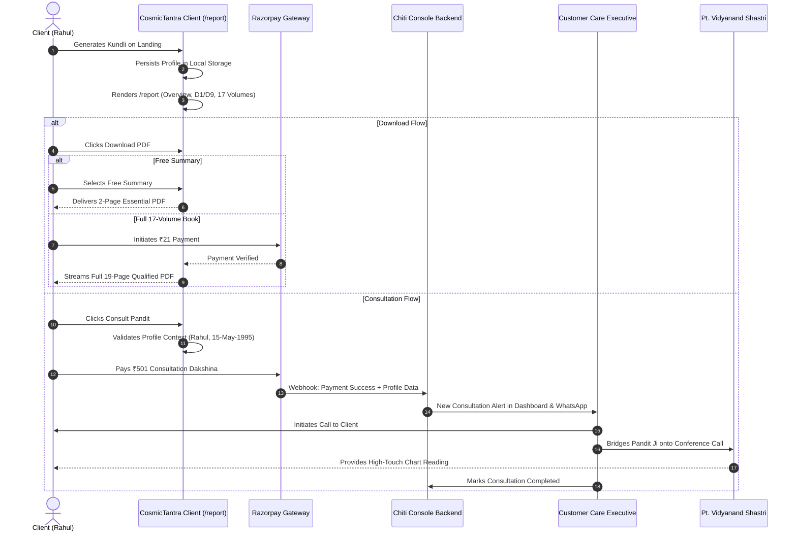

# CosmicTantra UX Architecture: Navigation Simplification, Unified "My Kundli" Space, Micro-Payment Funnel & Human Concierge Consultation

**Document Version:** 1.0.0  
**Status:** Approved Architecture Blueprint  
**Date:** September 2026  
**Target Systems:** CosmicTantra Web Client (`cosmictantra-v2`) & Chiti Console Operations (`Chiti-Console`)

---

## 1. Executive Product Strategy & Mental Model

CosmicTantra is an astronomical-grade Vedic intelligence platform. While its computation engine (ephemeris, vargas, ayanamsha, and 19-page report generation) is mathematically rigorous, the user journey must feel intuitive, sacred, and effortless.

The platform operates on a **Lifecycle Funnel**:
1. **Public Discovery (Anonymous)**: Sacred calendar, scriptures (Granth), celestial visualizer (Darshan), and intake.
2. **First Creation**: User enters birth details → profile is stored locally and activated.
3. **Personalized Sanctum**: Navigation transforms to reveal their persistent space:
   - Canonical Kundli Report (`/report`)
   - Personalized Daily Panchang with Tara Bala & Chandra Bala (`/daily`)
   - Kundali Milan (`/milan`) pre-populated with their chart
   - Family / Multi-profile manager (`Parivaar`)
4. **Value Realization & Monetization**:
   - **Free**: Immediate on-screen report and essential summary PDF download.
   - **₹21 Shubh Nivedan (Micro-payment)**: Full 17-Volume, 19-page qualified institutional Master PDF.
5. **High-Value Human Consultation (₹501+)**:
   - Anchored to the user's active birth chart.
   - Concierge-assisted 3-way WhatsApp / Voice call between User, Customer Care, and Pandit Ji.
   - Moderated and verified in real-time via **Chiti Console**.

---

## 2. Primary Navigation Architecture: The Two-Mode Shell

The global shell adapts automatically based on whether a user has an active profile (`hasActiveProfile`):

```
┌─────────────────────────────────────────────────────────────────────────────┐
│ MODE A: PUBLIC / ANONYMOUS VISITOR (First-time landing)                     │
├─────────────────────────────────────────────────────────────────────────────┤
│ [ॐ Logo]   Home  •  Today's Panchang  •  Granth  •  Darshan                  │
│                                           [📍 Location]  [✨ Create Kundli] [☰] │
└─────────────────────────────────────────────────────────────────────────────┘
                                      │
                   (User creates Kundli in any intake flow)
                                      ▼
┌─────────────────────────────────────────────────────────────────────────────┐
│ MODE B: PROFILE-ACTIVATED USER (Personal Space Active)                      │
├─────────────────────────────────────────────────────────────────────────────┤
│ Top Row:                                                                    │
│ [ॐ Logo]   Home  •  Today's Panchang  •  Granth  •  Darshan                  │
│                                    [📍 Location]  [👤 Rahul Sharma ▾] [☰]   │
│                                                                             │
│ Secondary Workspace Rail (Inside Active Space):                             │
│ ┌─────────────────────────────────────────────────────────────────────────┐ │
│ │ 📊 My Report (/report) | 💍 Milan | 🌟 My Days Panchang | 👨‍👩‍👧 Parivaar   │ │
│ └─────────────────────────────────────────────────────────────────────────┘ │
└─────────────────────────────────────────────────────────────────────────────┘
```

### Route Specifications:
- **Home (`/`)**: High-converting landing with birth intake, real-time Cosmic Now Dial, and Today At A Glance calendar.
- **Today's Panchang (`/daily`)**: Public astronomical calendar; when a profile is active, displays personal auspiciousness (Tara Bala / Chandra Bala).
- **Granth (`/granth`)**: Classical sacred texts (Bhagavad Gita, Upanishads, Jyotish shastras).
- **Darshan (`/darshan` / `/observatory`)**: Interactive 3D celestial sky & planetary positions.
- **My Kundli (`/report`)**: The single canonical personal report view.

---

## 3. Canonical "My Kundli" (`/report`) Architecture & Double Header Elimination

### 3.1 The Viewport Clutter Problem (Current State)
Currently on `/report`, two headers are stacked:
1. `GlobalHeader` (Logo, Lang, Theme, Location, Consult, Menu) ~ 68px.
2. Report Toolbar (Subject, DOB, View Tabs, Print, PDF, Edit) ~ 64px.
**Total sticky height: ~132px**, which consumes 20% of laptop screens and squeezes charts.

### 3.2 The Solution: Unified Contextual Report Bar
On `/report`, the `GlobalHeader` gracefully simplifies into a single 64px bar:

```
┌────────────────────────────────────────────────────────────────────────────────────────────────────────┐
│ [ॐ Logo]  Rahul Sharma (15 May 1995, Patna)  │  [ 📊 Overview | 📖 17-Vol Book | 🪐 Workbench ] │ [🖨️] [📄 PDF] [✏️ Edit] [☰] │
└────────────────────────────────────────────────────────────────────────────────────────────────────────┘
```

### 3.3 The Three Lenses of the Same Chart:
1. **Overview Tab**:
   - North Indian D1 (Lagna) & D9 (Navamsha) SVG charts.
   - Core identifiers: Lagna, Moon Sign, Nakshatra, Pada, Lord.
   - **Novice Cosmic Overview**: Plain-language explanations of personal strengths, key yogas, and active Vimshottari Mahadasha.
2. **17-Volume Book Tab**:
   - Traditional 17-chapter classical treatise with deep interpretive commentary.
3. **Workbench Tab**:
   - Advanced astronomical telemetry: Shodashvarga matrices, Shadbala values, Ashtakavarga points, Planetary aspects, and Bhava Chalit charts for astrologers and scholars.

---

## 4. Contextual Personalization Across Routes

When an active profile exists in browser storage (`cosmictantra_active_kundli` / `profileStore`), every page intelligently customizes:

| Route | Anonymous Experience | Profile-Active Experience |
|---|---|---|
| **`/` (Home)** | Intake form step 1/4 | "Welcome back Rahul — View Your Kundli →" card + intake reset option |
| **`/daily` (Panchang)** | General civil & astronomical panchang for chosen city | Personalized daily forecast: *"Chandra Bala favors you today (Moon in 11th house from Janma Rashi)"* |
| **`/milan` (Matching)** | Blank 2-partner intake | Partner A pre-filled with Rahul; prompt to input Partner B |
| **`/report`** | Clean sample preview with explicit benchmark banner | Rahul's personalized live chart, D1/D9, and 17-volume reading |
| **Header** | `[ ✨ Create Kundli ]` CTA | `[ 👤 Rahul Sharma ▾ ]` switcher with one-click access to Parivaar members |

---

## 5. Monetization & Download Funnel

### 5.1 Pricing Strategy: Sacred Shubh Nivedan (₹21)
Rather than a high-friction paywall, CosmicTantra employs a **₹21 sacred donation / dakshina** model:
- **Free Summary PDF**: 2-3 page high-level brief containing D1/D9 charts, basic planetary tables, and the Novice Overview.
- **₹21 Qualified Master PDF**: The full 19-page, 17-Volume institutional book with high-resolution SVG charts, complete dasha timelines, and Pandit Vidwan certification seal.

### 5.2 Download Modal Flow
```
User clicks [ 📄 Download PDF ]
                 │
                 ▼
┌─────────────────────────────────────────────────────────────┐
│ Choose Your Kundli Download Format                          │
├──────────────────────────────┬──────────────────────────────┤
│ 🆓 ESSENTIAL SUMMARY         │ 📜 QUALIFIED 17-VOLUME BOOK  │
│ • Free Forever               │ • ₹21 Shubh Nivedan          │
│ • D1 & D9 Visual Charts      │ • Complete 19-Page Dossier   │
│ • Key Planetary Degrees      │ • Full 17 Classical Volumes  │
│ • Novice Overview & Yogas    │ • 120-Year Vimshottari Dasha │
│                              │ • Pandit Vidwan Seal         │
│     [ Download Free ]        │    [ Pay ₹21 & Download ]    │
│                              │        (Razorpay Modal)      │
└──────────────────────────────┴──────────────────────────────┘
```

---

## 6. Assisted Pandit Consultation & Chiti Console Integration

### 6.1 Strict Profile-First Requirement
A consultation **cannot be initiated anonymously**. The user must have an active chart so that the consultation is grounded in verifiable mathematical Jyotish rather than vague guesswork.

### 6.2 The Assisted Human-in-the-Loop Journey
```
1. User clicks [ ✨ Consult Pandit ] on /report or /daily.
2. System packages active profile context:
   - Full Name, Gender, DOB, TOB, POB, Lat/Lng/Timezone.
   - Selected Concern: Career, Marriage, Health, or Spiritual.
3. User selects tier:
   - Shubh Vidwan Session: ₹501 (15 mins)
   - Deep Life Guidance: ₹1100 (30 mins)
4. Payment completed via Razorpay.
5. Automated Webhook & Notification Dispatch:
   - Order & Lead recorded in Chiti Console DB (`Order`, `Lead`, `ConsultationRequest`).
   - Automated WhatsApp dispatch to Customer Care Cockpit with chart link & question.
6. Concierge Coordination:
   - Customer Care dials the customer.
   - Customer Care bridges the assigned Pandit Ji onto a 3-way conference / WhatsApp call.
   - Pandit Ji has the exact CosmicTantra 17-Volume dossier open on his screen.
```

### 6.3 Chiti Console Dashboard Moderation
In **Chiti Console** (`d:\Projects\chiti-console`):
- Customer Care sees the incoming consultation request with payment status (`PAID`).
- View customer profile, chart link, and assigned scholar.
- Status stages: `PAYMENT_RECEIVED` → `COORDINATION_IN_PROGRESS` → `CALL_BRIDGED` → `CONSULTATION_COMPLETED`.

---

## 7. Operational Sequence Diagram



---

## 8. Implementation Roadmap

### Phase 1: Header Unification & Profile-Aware Navigation
- [ ] Add primary public links (`Home`, `Today's Panchang`, `Granth`, `Darshan`) to desktop `GlobalHeader.tsx`.
- [ ] Implement `hasActiveProfile` detection in header: display active persona pill with quick switcher to `My Report`, `Milan`, `My Days`, and `Parivaar`.
- [ ] Merge `/report` toolbar into the `GlobalHeader` on `/report`, eliminating the double-header stack and recovering 64px vertical height.

### Phase 2: Canonical `/report` Experience Consolidation
- [ ] Ensure all platform links to "My Kundli" route canonically to `/report`.
- [ ] Incorporate the First Insight D1/D9 view at the top of `/report` above the 3-lens switcher (`Overview`, `17-Volume Book`, `Workbench`).
- [ ] Connect personal panchang insights onto `/daily` when a profile is selected.

### Phase 3: ₹21 Shubh Nivedan Download Modal
- [ ] Create `DownloadChoiceModal.tsx`:
  - Free 2-page Essential Summary.
  - Full 19-page Qualified Master PDF.
- [ ] Prepare Razorpay checkout hook with graceful fallback for testing.

### Phase 4: Assisted Consultation & Chiti Console Bridge
- [ ] Create `ConsultationRequestModal.tsx` requiring an active chart profile.
- [ ] Format WhatsApp / Chiti Console payload with deep link to the user's specific chart snapshot.
- [ ] Provide status tracking in the user's personal space.
