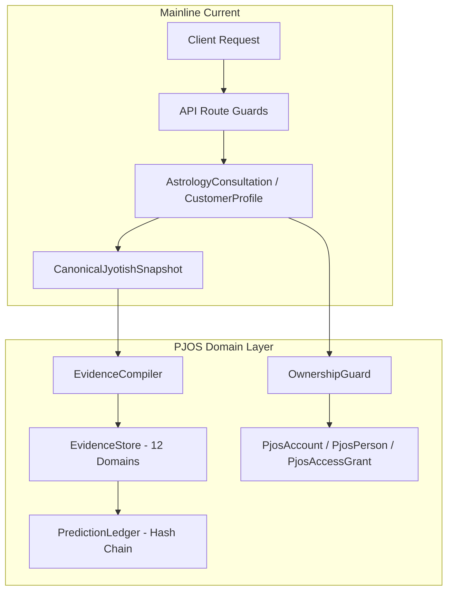

# PJOS Architecture Reconciliation & Entity Mapping

## 1. Executive Summary
This document analyzes the semantic overlap and migration strategy between existing mainline models/services and the newly integrated **PJOS-01-DOMAIN (Decision D-1)** architecture.

The mainline codebase and PJOS operate with complementary roles:
- **Mainline Legacy Models**: Power current public UI, Razorpay webhook checkout, consultation queues, and DPDP customer profiles.
- **PJOS-01 Additive Models**: Provide the mathematically pure, server-side Person identity, replaceable authentication transport, fine-grained access delegation, and immutable cryptographic evidence graphs.

**No existing tables or services are broken or deprecated abruptly.** Both systems co-exist cleanly with clear convergence paths for Phase 2.

---

## 2. Entity Mapping Matrix

| Domain Concept | Mainline Model / Service | PJOS-01 Additive Model / Service | Semantic Relationship | Canonical Strategy |
| :--- | :--- | :--- | :--- | :--- |
| **Principal / Identity** | `AstrologyCustomerProfile` (keyed by phone) | `PjosAccount` (keyed by authChannel + authSubject) | **Mainline** ties identity directly to WhatsApp phone number. **PJOS** decouples authentication credentials (Phone, Email, Google) from identity. | Keep `AstrologyCustomerProfile` active for existing workflows. In Phase 2, map `PjosAccount` as the unified credential anchor. |
| **Charted Person** | `AstrologyFamilyMember` / `callerName` + `subjectName` | `PjosPerson` + `PjosPersonRelationship` | **Mainline** stores family members embedded under a customer profile. **PJOS** treats every person as an independent entity linked via explicit relationship graphs (`SELF`, `GUARDIAN_MANAGED`, `WITH_CONSENT`). | `PjosPerson` is the canonical model for all future birth charts and evidence graph compilations. |
| **Practitioner / Pandit** | `AstrologyConsultant` | `granteePractitionerId` in `PjosAccessGrant` | **Mainline** stores Pandit profiles. **PJOS** delegates access to practitioners via time-bounded, scope-restricted access grants. | Keep `AstrologyConsultant` for directory listings; gate dossier access through `PjosAccessGrant`. |
| **Astrological Truth** | `CanonicalJyotishSnapshot` (`canonicalSnapshot.ts`) | `EvidenceStore` (`evidenceGraph.ts`) + `evidenceCompiler.ts` | **Mainline** computes the single authoritative astronomical snapshot. **PJOS** content-addresses all computed facts into a 12-domain directed acyclic graph (DAG) with dependency tracking. | `CanonicalJyotishSnapshot` remains the sole celestial computation engine; `EvidenceStore` is the immutable provenance layer compiled from it. |
| **Predictions & Notes** | `aiDraft` / `practitionerFinal` in `AstrologyConsultation` | `PredictionLedger` (`PredictionRecord`) | **Mainline** stores raw text strings in consultation rows. **PJOS** maintains an append-only, tamper-evident SHA-256 hash chain where status is derived from evidence citations. | Mainline text fields continue for UI display; `PredictionLedger` enforces anti-fake tamper protection. |
| **Access Control** | `verifyAdminAuth` / `requireAdminAuth` (`src/lib/auth.ts`) | `checkOwnership` / `assertOwnership` (`ownershipGuard.ts`) | **Mainline** verifies admin/operator bearer tokens at API routes. **PJOS** enforces granular `resource -> personId -> relationship / grant` checks. | Route boundaries verify transport tokens; domain layer executes `assertOwnership`. |
| **Consent & DPDP** | `consentGiven`, `consentAt` in `AstrologyCustomerProfile` | `PjosConsentRecord` (`PjosConsentStatus`) | **Mainline** uses boolean column flags. **PJOS** records append-only immutable consent events with sensitivity ladder, purpose, and versioning. | Mainline booleans read from active `PjosConsentRecord` instances during sync. |

---

## 3. Coexistence & Phased Migration Plan

### Phase 1 (Current - Integrated):
- Mainline routes continue to function without schema regressions.
- Security fixes (SEC-P0-001, SEC-P0-002, fake ChatBox removal) are active.
- `EvidenceStore`, `evidenceCompiler`, `ownershipGuard`, and additive Prisma models are compiled, tested, and verified.

### Phase 2 (Migration):
- Backfill script generates `PjosPerson` and `PjosAccount` records from existing `AstrologyCustomerProfile` and `AstrologyConsultation` rows.
- Wire `ownershipGuard` into the consultation mutation pipeline.
