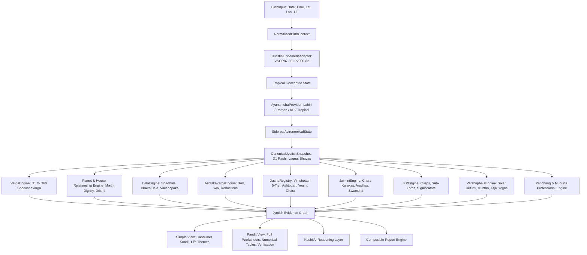

# CosmicTantra Professional Jyotish Kernel Architecture Plan

**Document ID**: `CT-JYOTISH-KERNEL-PLAN-2026`  
**Target Reference Softwares**: *Parashara's Light 9.0*, *Jagannatha Hora 8.0*, *Kundli Chakra Professional*, *Kala*  
**Auditor & Architect**: Technical Head & Systems Architect  
**Status**: APPROVED FOR PROGRESSIVE RELEASE (Release 1 Active)

---

## 1. Executive Summary & Philosophy

The CosmicTantra Professional Jyotish Kernel upgrades the existing web Kundli engine into a deterministic, offline-grade Vedic calculation system matching the depth of mature desktop astrology software.

### Core Architectural Invariants:
1. **`INV_JYOTISH_001` (Single Source of Truth)**: One canonical astronomical state (`SiderealAstronomicalState`) calculated from `NormalizedBirthContext` feeds all downstream engines. No page or component calculates planetary positions independently.
2. **`INV_JYOTISH_002` (Calculation Provenance)**: Every derived calculation exposes `algorithmVersion`, `tradition`, `calculationOptions`, `sourceInputs`, and `evidenceIds`.
3. **`INV_JYOTISH_003` (Explicit Convention Modeling)**: Different traditions (e.g. Parashari vs Jaimini aspects, Lahiri vs Raman Ayanamsha, Mean vs True Nodes) are modeled explicitly and never silently conflated.
4. **`INV_JYOTISH_004` (Fail-Closed on Missing Capabilities)**: Missing calculation != estimated calculation. Return `NOT_IMPLEMENTED` or `UNKNOWN`.
5. **`INV_JYOTISH_005` (Strict Separation of AI & Deterministic Truth)**: AI/LLM layers (Kashi Sahayak) interpret evidence graphs; they never generate deterministic celestial positions or mathematical scores.
6. **`INV_JYOTISH_006` (Headless Engine Independence)**: Every calculation engine is a pure, stateless, headless TypeScript/JavaScript module independently testable without UI or network.
7. **`INV_JYOTISH_007` (Celestial Protection)**: Qualified in-process celestial ephemeris algorithms (VSOP87 / ELP2000-82) are frozen and never modified for downstream astrological heuristics.

---

## 2. Master Calculation Pipeline DAG

---

## 3. Seven-Release Progressive Implementation Roadmap

| Milestone | Target Calculation Families | Scope & Deliverables |
| :--- | :--- | :--- |
| **Release 1** | **Vargas, Relationships, Balas** | Generic Varga Engine (D1–D60), Naisargika/Tatkalika/Panchadha Maitri, Graha & Rashi Drishti, Full Shadbala (6 Balas in Virupas/Rupas), Bhava Bala, Vimshopaka Bala. |
| **Release 2** | **Ashtakavarga, Avasthas, Panchang, Points** | BAV 8 planets, SAV 337 bindus, Trikona & Ekadhipatya Shodhana, Baladi/Jagradadi/Deeptadi/Shayanadi Avasthas, Professional Panchang transitions, Upagrahas, Mandi/Gulika, Special Lagnas. |
| **Release 3** | **Dasha Framework & Systems** | Dasha Registry, Vimshottari 5-Tier (Maha to Prana), Ashtottari (108y), Yogini (36y), Jaimini Chara Dasha. |
| **Release 4** | **Jaimini & KP Systems** | 7/8 Chara Karaka sorting, Arudha Lagna (AL/UL), Karakamsha, KP 249 Sub-lords, Placidus cuspal interlinks, 1–249 horary seeds. |
| **Release 5** | **Varshaphala, Transits, Prashna** | Exact Solar Return instant, Muntha, Varshesha, Tajik Yogas & Sahams, Patyayini Dasha, Real-time Transit Timeline, Horary Prashna Engine. |
| **Release 6** | **Professional Workspace & Workbench** | Multi-panel customizable Jyotish Workbench, persistent Pandit templates, responsive glassmorphism UI, composable report builder. |
| **Release 7** | **Evidence Graph & Kashi Integration** | Fine-grained evidence IDs (`PLANET.SATURN.D1`, `SHADBALA.SUN`), evidence-anchored conversational explanations, Pandit verification lab. |

---

## 4. UI Layering: Simple View vs. Pandit View

Both views consume the identical canonical snapshot and evidence graph:
- **Simple View (Consumer Experience)**: Rashi chart, Lagna summary, prevailing Mahadasha/Antardasha, core strengths, Manglik & Sade Sati status, plain-language interpretations.
- **Pandit View (Professional Experience)**: Complete 16 Varga grid, detailed Shadbala breakdown (Sthana, Dig, Kala, Cheshta, Naisargika, Drik tables), Ashtakavarga matrices, Sub-lord tables, Jaimini Karakas, manual calculation option overrides, evidence inspector.
