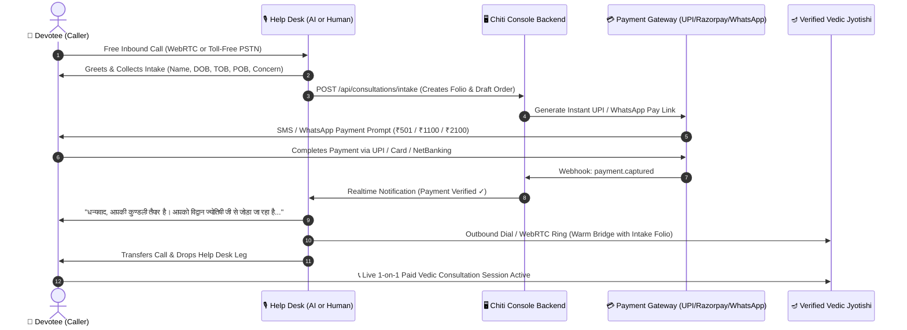
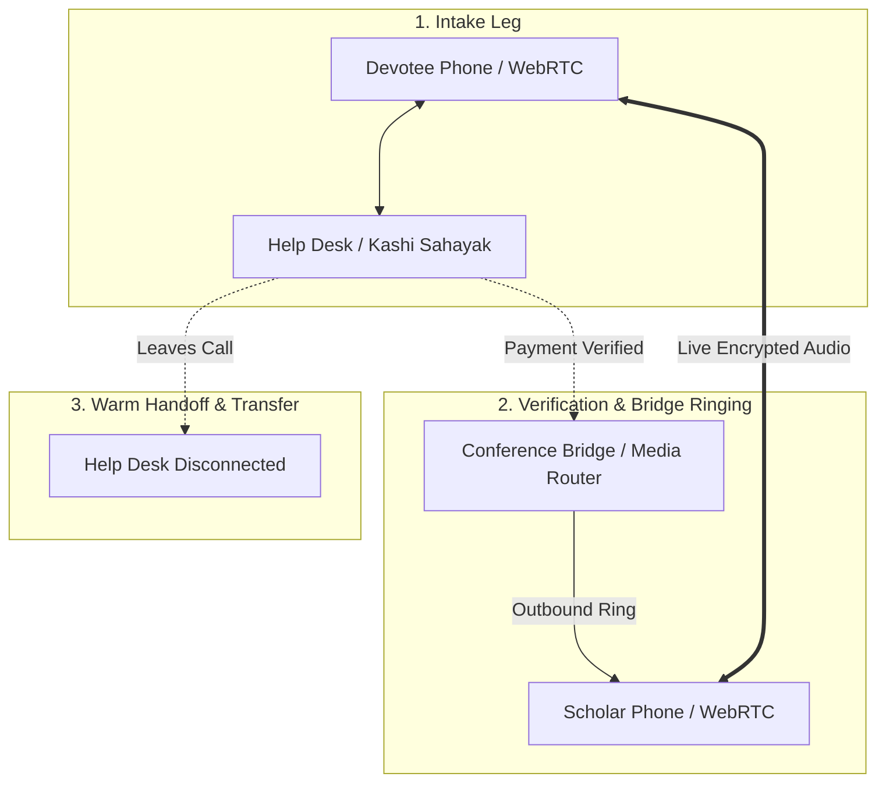

# CosmicTantra — Free Voice Help Desk, Chiti Console Payment Verification & Live Scholar Call Transfer Engine

## 1. Executive Summary & Flow Vision

This architecture enables devotees to initiate a **free inbound audio call** (either via in-browser WebRTC or standard toll-free/virtual PSTN phone numbers) to a **Help Desk triage layer**, verify or collect payment on **Chiti Console**, and seamlessly execute a **live call transfer** to a verified Vedic Scholar / Jyotishi for their paid consultation.



---

## 2. Help Desk Operator Options: AI Voice vs. Human vs. Hybrid

### Option A: Free AI Voice Agent ("Speaking Kashi Sahayak")
A real-time, bilingual (Hindi/English) conversational voice AI with sub-second latency that answers immediately 24/7:
- **Speech-to-Text (STT)**: Sarvam AI Saaras / Deepgram Nova-2 / OpenAI Whisper (understands colloquial Hindi, Sanskrit astrological terms, mixed Hinglish, and regional accents).
- **Core Intelligence (LLM + Guardrails)**: Kashi Sahayak Vedic Gateway (`INTENT_REGISTRY`, intake extraction schema, zero hallucination guardrails).
- **Text-to-Speech (TTS)**: Sarvam Bulbul / ElevenLabs Multilingual v2 / Azure Neural Hindi (`hi-IN-MadhurNeural` / `hi-IN-SwaraNeural`) with calm, reverent temple-grade phonetics.
- **Cost**: ~$0.02 to $0.05 per call intake session (extremely scalable, zero salary overhead).

### Option B: Human Help Desk Operator (Receptionist Desk)
A dedicated support console inside **Chiti Console**:
- Inbound call rings on human agent's WebRTC softphone or forwarded mobile phone.
- Agent sees the **Devotee Intake Form** with 350+ Indian cities and live GPS coordinate selector.
- Agent clicks **"Send Instant UPI / WhatsApp Link"**.
- Agent sees the green **"PAYMENT VERIFIED"** badge flash live via WebSocket.
- Agent clicks **"Transfer to Pt. Vidyanand Shastri"** (one-click warm transfer).

### Option C: The Recommended Hybrid Model (Auto-AI with Human Fallback)
1. **Default**: Voice AI Kashi Sahayak answers every call on Ring 1 (zero hold time).
2. AI collects Name, Date, Time, Place of Birth, and calculates Lagna & Dasha in the background.
3. AI triggers the WhatsApp / SMS payment link and polls for confirmation.
4. If devotee completes payment $\rightarrow$ AI transfers directly to the Jyotishi.
5. If devotee requests human assistance ("मुझे किसी प्रतिनिधि से बात करनी है" / "Help me pay") $\rightarrow$ AI executes a warm transfer to the human Chiti Console support desk!

---

## 3. Detailed Telephony & Live Transfer Architecture

### 3.1 Telephony Ingestion Layer
Two parallel access channels:
1. **WebRTC In-App Free Call** (Zero carrier telephony costs):
   - Devotee clicks **"🎙️ Call Help Desk (Free)"** on the website or mobile PWA.
   - Connects via WebRTC audio stream to LiveKit / Daily.co audio room.
2. **PSTN Toll-Free / Virtual Landline DID** (Standard phone dialing):
   - Devotee dials `1800-XXX-XXXX` or local virtual DID via **Exotel / Twilio / Tata Tele / Plivo**.
   - SIP trunk routes the RTP audio packets directly to our Voice AI / Operator Bridge.

### 3.2 Live Call Transfer Mechanism
When payment is confirmed on Chiti Console, the live call must be transferred to the Jyotishi without dropping the caller.



1. **Conference Bridging Pattern (Most Reliable for India PSTN)**:
   - Call starts in a private conference room `conf_room_<session_id>`.
   - Caller Leg is connected to Help Desk Leg.
   - Upon payment confirmation, the server dials the Scholar's registered mobile number / WebRTC terminal and adds them to `conf_room_<session_id>`.
   - Help Desk whispers brief intake context to scholar (*"पंडित जी, राहुल जी धनबाद से विवाह सम्बन्धी परामर्श हेतु जुड़े हैं, कुण्डली स्क्रीन पर उपलब्ध है"*).
   - Help Desk disconnects; Caller and Scholar remain connected for the consultation timer (e.g. 15 / 30 mins).
2. **SIP REFER (Native Telephony Transfer)**:
   - SIP server instructs carrier switch to transfer caller leg directly to scholar URI.

---

## 4. Chiti Console Real-time Integration & Schema

### 4.1 Database Models (Prisma in Chiti Console)

```prisma
enum CallSessionStatus {
  INCOMING
  INTAKE_COLLECTED
  PAYMENT_PENDING
  PAYMENT_VERIFIED
  TRANSFERRING
  IN_CONSULTATION
  COMPLETED
  FAILED
}

enum IntakeSource {
  AI_VOICE_AGENT
  HUMAN_OPERATOR
  IN_APP_WEBRTC
  PSTN_TOLL_FREE
}

model ConsultationCallSession {
  id              String            @id @default(cuid())
  callSid         String            @unique // Telephony Carrier Call SID / Room ID
  source          IntakeSource      @default(AI_VOICE_AGENT)
  callerPhone     String?
  callerName      String?
  
  // Astrological Intake
  birthDate       DateTime?
  birthTime       String?
  birthPlace      String?
  latitude        Float?
  longitude       Float?
  timezone        Float             @default(5.5)
  consultationTopic String?         // MARRIAGE, CAREER, HEALTH, MUHURAT, PUJA
  
  // Payment Verification
  status          CallSessionStatus @default(INCOMING)
  orderId         String?           @unique
  orderAmount     Float?
  paymentStatus   PaymentStatus     @default(PENDING)
  paymentLinkUrl  String?
  paymentReceivedAt DateTime?
  
  // Scholar Allocation & Transfer
  assignedScholarId String?
  scholarPhone    String?
  callTransferAt  DateTime?
  consultationDurationSec Int       @default(0)
  recordingUrl    String?
  
  createdAt       DateTime          @default(now())
  updatedAt       DateTime          @updatedAt
}
```

---

## 5. Speaking Kashi Sahayak Voice AI Intake Prompt & State Machine

```
ROLE: Kashi Sahayak Voice Receptionist (काशी सहायक वाणी प्रतिनिधि)
TONE: Calm, respectful, polite, crisp Vedic intake assistant.
LANGUAGE: Fluent conversational Hindi & English (code-switching based on caller).

STATE 1: GREETING & PURPOSE
"नमस्ते! कॉस्मिक तंत्रा वैदिक सेवा केंद्र में आपका स्वागत है। मैं काशी सहायक हूँ। 
विद्वान ज्योतिषी जी से परामर्श हेतु, कृपया अपना शुभ नाम और जन्म विवरण बताएं।"

STATE 2: BIRTH DETAILS COLLECTION
- Asks for Name
- Asks for Date of Birth (दिन, महीना, वर्ष)
- Asks for Exact Time of Birth (घंटे, मिनट, AM/PM)
- Asks for Birth City / District (नगर व राज्य)
- Asks for Primary Question (विवाह, व्यवसाय, स्वास्थ्य, मुहूर्त)

STATE 3: PAYMENT GENERATION & PROMPT
"धन्यवाद [नाम] जी। आपकी कुण्डली तैयार कर ली गई है। 
विद्वान ज्योतिषी जी से १५ मिनट के प्रत्यक्ष परामर्श का शुल्क ₹५०१ है। 
आपके मोबाइल नंबर पर भुगतान लिंक भेज दिया गया है। कृपया UPI द्वारा भुगतान पूर्ण करें।"

STATE 4: PAYMENT LISTENER & TRANSFER
- Listens to WebSocket event `payment.captured`
- Once received:
"धन्यवाद! आपका भुगतान सफलतापूर्वक प्राप्त हो गया है। 
मैं आपकी कॉल वाराणसी परंपरा के विद्वान पंडित जी को स्थानांतरित कर रहा हूँ। कृपया लाइन पर बने रहें।"
- Executes `transferCall(session.id, scholar.phone)`
```

---

## 6. Chiti Console Human Operator Screen (Call Desk Cockpit)

For human operators, Chiti Console provides a dedicated live cockpit:

```
+-----------------------------------------------------------------------------------------+
| CHITI CONSOLE • LIVE TELEPHONY & HELP DESK COCKPIT                     [● 3 Calls Live] |
+-----------------------------------------------------------------------------------------+
| CALL QUEUE (LIVE)              | DEVOTEE INTAKE & KUNDLI FOLIO                          |
| ----------------------------- | ------------------------------------------------------- |
| [● ACTIVE] +91 98351 XXXXX    | Caller: Rahul Sharma (Dhanbad, JH)                      |
| Mode: PSTN Toll-Free Inbound  | DOB: 14-Aug-1995 | Time: 14:30 | Lat: 23.79°N, 86.43°E  |
| Handled by: Kashi Sahayak AI  | Question: Marriage Kundali Milan & Dasha Timing         |
| Status: WAITING FOR PAYMENT   | Lagna: Vrischika (Scorpio) | Moon: Revati Nakshatra     |
| ----------------------------- | ------------------------------------------------------- |
| PAYMENT VERIFICATION STATUS:                                                            |
| [ ₹501 Consultation Fee ]  --> [ Send WhatsApp UPI Link ] [ Resend SMS ]                |
| Status: [✓ PAYMENT RECEIVED VIA PHONEPE (TXN_9876234)]  (Auto-verified 4s ago)          |
| --------------------------------------------------------------------------------------- |
| SCHOLAR CALL TRANSFER CONTROL:                                                          |
| Available Scholars:                                                                     |
| (•) Pt. Vidyanand Shastri [Available • Varanasi Tradition] (Rating: 4.9)                |
| ( ) Acharya Mukund Dev    [Available • Vedic Muhurat Specialist]                        |
|                                                                                         |
| [ 📞 TRANSFER CALL TO SCHOLAR NOW ]     [ 🎙️ Whisper to Scholar ]    [ ❌ End Session ] |
+-----------------------------------------------------------------------------------------+
```

---

## 7. Implementation Roadmap & Phased Delivery

| Phase | Milestone | Deliverables | Timeline |
|---|---|---|---|
| **Phase 1** | **Chiti Console Intake & Call Session API** | Prisma schema migration, `POST /api/telephony/intake`, `/api/telephony/verify-payment`, WebSocket notification pipeline | Week 1 |
| **Phase 2** | **Payment Webhook Auto-Trigger** | Razorpay / UPI Intent webhook listener connecting payment ID $\rightarrow$ `CallSession` status update | Week 1 |
| **Phase 3** | **In-App Free WebRTC Audio Call Desk** | In-browser "Call Help Desk (Free)" UI component with live microphone streaming and audio bridge | Week 2 |
| **Phase 4** | **Speaking Kashi Sahayak Voice AI Engine** | Integration with Sarvam AI / Deepgram STT + ElevenLabs / Azure TTS + low-latency audio pipeline | Week 2-3 |
| **Phase 5** | **PSTN Telephony & Live Call Transfer** | Twilio / Exotel SIP trunk with programmable conference bridging for 1-click scholar transfer | Week 3 |
| **Phase 6** | **Chiti Console Operator Cockpit UI** | Multi-agent dashboard for human support desk with live call controls, WhatsApp messaging, and transfer buttons | Week 4 |
