# DETERMINISTIC TRUTH GRAPH & RUNTIME CALL PATHS

**Project:** CosmicTantra (Chiti Technologies)  
**Evaluation Scope:** Complete Mapping of UI Surfaces to Underlying Calculation Engines  
**Date:** August 29, 2026  

---

## 1. Top-Level Architectural Truth Map

The diagram below exposes the actual, unvarnished runtime calculation paths across CosmicTantra's user-facing surfaces:

```mermaid
graph TD
    subgraph UI Surfaces
        CN[Cosmic Now HUD]
        TH[Today At A Glance / Home]
        KE[Kundali Experience / Observatory]
        DH[Dasha Hero / Timeline]
        AMC[Aura Monthly Calendar]
        PW[Pandit Workspace / Cockpit]
        IE[Daily / Family Interpretation]
        KM[Kundali Milan Tool]
    end

    subgraph Competing Engine Implementations
        E_PANCHANG[src/engines/panchang.js<br/>⚠️ 2-term Moon, Hardcoded 6AM Sunrise]
        L_PANCHANG[src/lib/panchang.js<br/>✅ Eq of Time Sunrise, 4-term Moon]
        M_PANCHANG[src/engines/monthlyPanchangEngine.ts<br/>✅ Full Month Grid Solver]
        
        L_ASTRO[src/lib/astrologyEngine.js<br/>✅ Canonical Kundali & Lagna Engine]
        E_ASTRO[src/engines/astrologyEngine.js<br/>🔗 Re-export alias to lib/astrologyEngine.js]
        
        L_DASHA[src/lib/dashaEngine.js<br/>✅ 3-Tier Dasha: Maha/Antar/Pratyantar]
        E_DASHA[src/engines/dashaEngine.js<br/>⚠️ 2-Tier Dasha: Maha/Antar only]
        
        L_INTERP[src/lib/interpretationEngine.ts<br/>✅ Multi-Horizon Transit Synthesis]
        L_MILAN[src/lib/kundaliMilan.js<br/>✅ 36-Guna Ashtakoota Engine]
    end

    CN -->|❌ Uses low-precision duplicate| E_PANCHANG
    TH -->|✅ Uses canonical lib| L_PANCHANG
    AMC -->|✅ Uses month solver| M_PANCHANG
    
    KE -->|✅ Uses canonical lib| L_ASTRO
    PW -->|✅ Uses canonical lib| L_ASTRO
    
    DH -->|❌ Uses 2-tier duplicate| E_DASHA
    IE -->|✅ Uses 3-tier lib| L_DASHA
    IE -->|✅ Uses canonical lib| L_ASTRO
    IE -->|✅ Uses canonical lib| L_PANCHANG
    
    KM -->|✅ Uses 36-Guna lib| L_MILAN

    classDef broken fill:#fee2e2,stroke:#ef4444,stroke-width:2px;
    classDef canonical fill:#dcfce7,stroke:#22c55e,stroke-width:2px;
    classDef duplicate fill:#fef3c7,stroke:#f59e0b,stroke-width:2px;

    class CN,E_PANCHANG,E_DASHA broken;
    class L_ASTRO,L_PANCHANG,L_DASHA,M_PANCHANG,L_INTERP,L_MILAN canonical;
    class E_ASTRO duplicate;
```

---

## 2. Surface-by-Surface Deep Trace

### 1. Cosmic Now (`src/components/CosmicNow.tsx`)
- **Imported Function**: `calculatePanchang` from `@/engines/panchang.js`
- **Execution Path**:
  `CosmicNow.tsx:48` $\rightarrow$ `calculatePanchang(now, lat, lon, tz)` $\rightarrow$ `src/engines/panchang.js`
- **Astronomical Math**:
  - Uses `getSunLon(T)` (1 harmonic term) and `getMoonLon(T)` (2 harmonic terms).
  - Hardcodes `sunriseHour = 6.0` and `sunsetHour = 18.0`.
  - Calculates Instantaneous Tithi at `now` (e.g. 10:00 PM) instead of Udaya Tithi at Sunrise.
- **Architectural Status**: ❌ **CRITICAL DEFECT — DUPLICATE_TRUTH_PATH**.

### 2. Today At A Glance (`src/components/TodayAtAGlance.jsx`) & Home
- **Imported Function**: `calculatePanchang` from `@/lib/panchang.js`
- **Execution Path**:
  `TodayAtAGlance.jsx:22` $\rightarrow$ `calculatePanchang(now, city)` $\rightarrow$ `src/lib/panchang.js`
- **Astronomical Math**:
  - Uses `getSunTimes(date, lat, lng, tz)` with Equation of Time, solar declination, and atmospheric refraction ($90.833^\circ$).
  - Calculates true sunrise, sunset, solar noon, Rahu Kaal, Yamaganda, Gulika.
- **Architectural Status**: ✅ **CANONICAL ENGINE**.

### 3. Kundali Experience & Observatory (`src/components/KundaliExperience.jsx`)
- **Imported Function**: `calculateKundali` from `@/lib/astrologyEngine.js`
- **Execution Path**:
  `KundaliExperience.jsx:110` $\rightarrow$ `calculateKundali(birthDate, birthTime, lat, lon, tz, cityName)` $\rightarrow$ `src/lib/astrologyEngine.js`
- **Astronomical Math**:
  - Full Julian Date calculation, Chitra Paksha Lahiri Ayanamsha, Local Sidereal Time (LST), Lagna, 9 Sidereal Grahas with dignities and Parashari house placements.
- **Architectural Status**: ✅ **CANONICAL ENGINE**.

### 4. Dasha Hero / Timeline (`src/components/DashaHero.jsx`)
- **Imported Function**: `calculateVimshottariDasha` from `@/engines/dashaEngine.js`
- **Execution Path**:
  `DashaHero.jsx:42` $\rightarrow$ `calculateVimshottariDasha(moonNakshatra, birthDate)` $\rightarrow$ `src/engines/dashaEngine.js`
- **Astronomical Math**:
  - Computes only 2 tiers (Mahadasha and Antardasha).
  - Contrasts with `src/lib/dashaEngine.js` which computes all 3 tiers (**Mahadasha, Antardasha, and Pratyantardasha**).
- **Architectural Status**: ⚠️ **SUB-OPTIMAL DUPLICATE**.

### 5. Aura Monthly Calendar (`src/components/calendar/AuraMonthlyCalendar.tsx`)
- **Imported Function**: `generateMonthPanchang` from `@/engines/monthlyPanchangEngine.ts`
- **Execution Path**:
  `AuraMonthlyCalendar.tsx:85` $\rightarrow$ `generateMonthPanchang(year, month, lat, lon, tz, profile)` $\rightarrow$ `src/engines/monthlyPanchangEngine.ts`
- **Astronomical Math**:
  - Full 30-day month grid solver, Udaya Tithi, Nakshatra, Shubh Muhurats (Abhijit, Brahma, Amrit, Vijay), Tara Bala, Chandra Bala, dynamic festival resolution.
- **Architectural Status**: ✅ **ROBUST DOMAIN ENGINE**.

### 6. Multi-Horizon Interpretation Engine (`src/lib/interpretationEngine.ts`)
- **Imports**: `calculateKundali` (`src/lib/astrologyEngine.js`), `calculatePanchang` (`src/lib/panchang.js`), `calculateVimshottariDasha` (`src/lib/dashaEngine.js`).
- **Synthesis**: Combines natal chart, daily panchang, transits (Gochar), Tara Bala, Chandra Bala, and Vimshottari period into 72-hour daily, 7-day weekly, 30-day monthly, and 12-month annual forecasts.
- **Architectural Status**: ✅ **CANONICAL INTERPRETIVE ENGINE**.
