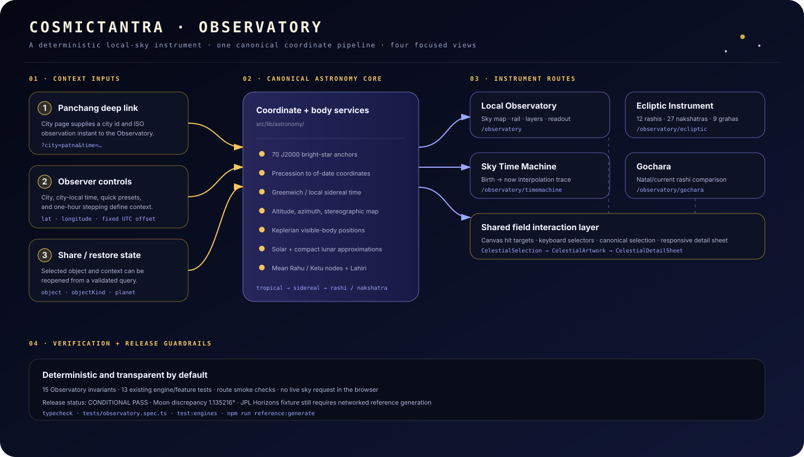
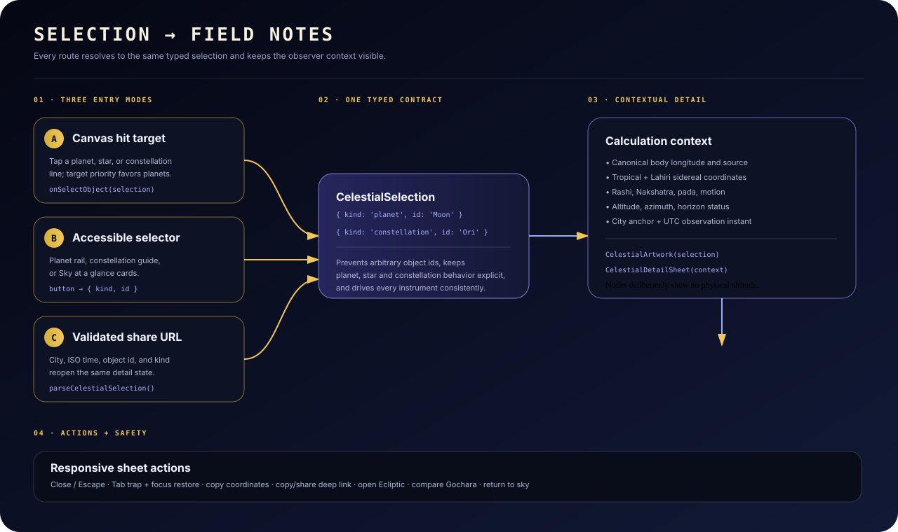
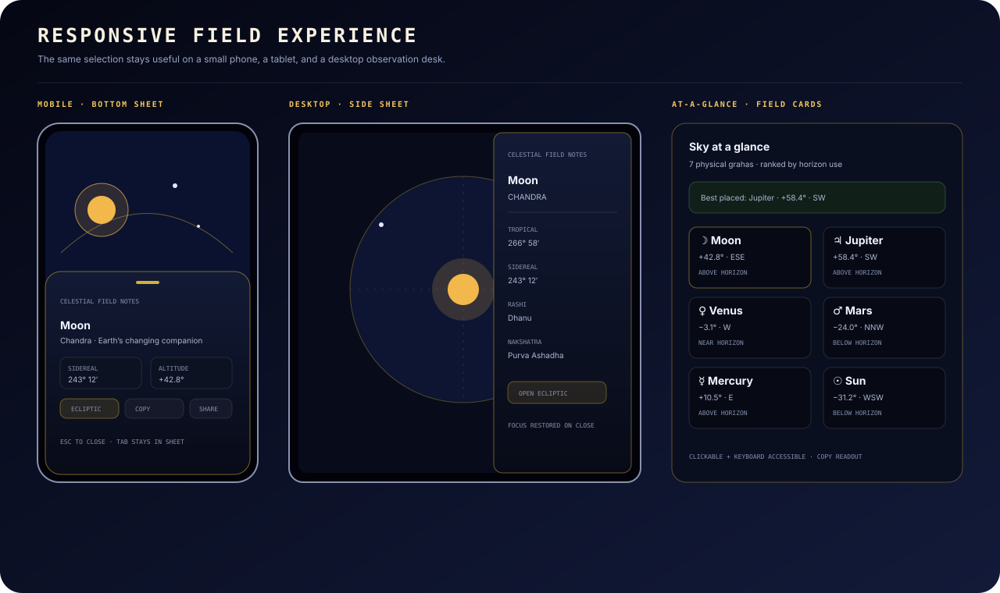

# CosmicTantra Observatory — Complete Blueprint, Design Record, and Change Ledger

**Document status:** implementation record for the shipped Observatory work
**Last updated:** 26 August 2026 (Asia/Calcutta)
**Branch:** `arena/01a03b32-cosmictantra-v2`
**Latest commit:** `f7cae0a feat: add local observatory field log`
**Release qualification:** **CONDITIONAL PASS**

This document records what was built, why it was built that way, how the pieces connect, which visual assets are used, every meaningful polish step, and what remains before a precision-astronomy release claim would be justified.

> The Observatory is an educational and operational visual instrument. It is intentionally transparent about its local ephemeris approximations and must not be described as JPL-grade or sub-degree lunar authority until the documented reference blockers are closed.

---

## 1. Executive summary

CosmicTantra now has a deterministic, browser-rendered Observatory suite that connects Panchang context to a visual local sky and Vedic coordinate tools. The work is intentionally split into four instruments rather than one overloaded chart:

1. **Local Observatory** — a zenith-centred stereographic sky for a selected instant and city.
2. **Ecliptic Instrument** — a tropical ecliptic planisphere with rashi, Nakshatra, and all nine calculated grahas.
3. **Sky Time Machine** — a birth-to-now scrubber for inspecting transit movement and rashi changes.
4. **Gochara** — a natal/current sidereal rashi comparison with a Moon-reference transit panel.

The shared interaction model means a planet or constellation can be selected from the canvas, a DOM control, an accessible guide, or a deep link. Every selection resolves to the same typed contract and can open the same responsive field-note sheet.

The latest usefulness pass added the practical layer that turns a visualization into an observation tool:

- a **Sky at a glance** readout for seven physical grahas;
- current altitude, azimuth, compass direction, horizon status, and rashi;
- a best-placed object recommendation for the selected instant;
- a copyable plain-text field readout;
- city-local time inputs with explicit ISO UTC calculation context;
- Now, Dusk, Night, Midnight, −1 hour, and +1 hour controls;
- a keyboard-friendly constellation selector;
- URL synchronization and validated object restoration;
- Rahu/Ketu plotted on the ecliptic as mathematical nodes, without pretending they are physical planets.

The Evidence-backed Observation + Student Study Desk v1 slice then added:

- bounded display-only zoom, pan, pinch, wheel, double-click, keyboard navigation, and reset controls across the local sky, ecliptic, and Gochara canvases;
- progressive bright-star labels and an accessible visible-anchor list;
- approximate solar events, civil/nautical/astronomical twilight state, Moon phase, altitude bands, field cues, and a reusable student briefing;
- an integrated astronomy/Jyotish study desk with optional official-source link-outs rather than live media dependencies;
- an approximate selected-body observation planner with current horizon status, sampled next rise/set estimate, Moon separation, and explicit Rahu/Ketu exclusion;
- a browser-local observation notebook that saves reproducible snapshots and exports JSON/CSV without an account or runtime service;
- a provenance block that states quality, model, frame, epoch, fixture status, Moon discrepancy and node semantics;
- implementation/validation notes in `docs/observatory/EVIDENCE_OBSERVATION_V1.md`.

---

## 2. Blueprint images

These diagrams are repository-owned SVG documentation assets. They are not screenshots and do not replace browser QA; they provide a stable, versioned visual explanation of the system when a browser or Chromium is unavailable.

### 2.1 System architecture



**File:** `docs/observatory/assets/observatory-architecture.svg`

The architecture diagram shows the flow from Panchang/deep-link context through the canonical astronomy core, into the four instruments, and finally through the shared selection/detail layer.

### 2.2 Selection and detail flow



**File:** `docs/observatory/assets/observatory-interaction-flow.svg`

The interaction diagram explains why canvas hits, accessible controls, and shared URLs all converge on `CelestialSelection` instead of implementing separate planet/constellation logic.

### 2.3 Responsive layout



**File:** `docs/observatory/assets/observatory-responsive-layout.svg`

The responsive diagram documents the mobile bottom-sheet treatment, desktop side-sheet treatment, and the practical field-card grid.

---

## 3. Product purpose and user jobs

### Primary user jobs

| User need | Implemented response |
| --- | --- |
| “What is in the sky from this place and time?” | City selector, city-local time input, UTC context, stereographic sky, altitude rings, cardinal directions, and Sky at a glance. |
| “Where is a particular graha?” | Planet rail, canvas target, practical readout card, ecliptic selector, Time Machine selector, and Gochara selector. |
| “How does the physical sky relate to Vedic coordinates?” | Tropical ecliptic ring plus separate Lahiri sidereal inspector, rashi, Nakshatra, and pada values. |
| “Can I inspect a constellation without hitting a tiny star?” | Constellation guide select, constellation target hit areas, schematic field artwork, and a constellation detail sheet. |
| “Can I carry this observation to another route or person?” | City/time/planet query links, share URLs containing object and object type, copyable coordinates, and copyable plain-text readouts. |
| “Can I use it without a mouse?” | Native selects/buttons, keyboard focus rings, sheet focus trapping/restoration, Escape-to-close, and DOM-accessible planet cards. |
| “Can I trust what is calculated?” | Source labels, explicit frame language, no live browser sky request, accuracy caveats, deterministic tests, and a conditional qualification report. |

### Deliberately excluded claims

The implementation does **not** claim:

- real-time atmospheric refraction, terrain, clouds, or light-pollution modeling;
- precision rise/set or visibility predictions;
- JPL-grade planetary coordinates;
- sub-degree lunar accuracy;
- a complete Jyotish judgement from Gochara alone;
- physical altitude/azimuth for Rahu and Ketu;
- live third-party astronomy-service dependence in the browser.

---

## 4. Route map and responsibilities

| Route | Purpose | Main context | Main interactive outputs |
| --- | --- | --- | --- |
| `/observatory` | Local sky view | City, city-local observation time, selected planet/constellation | Stereographic sky, planet rail, layers, constellation guide, Sky at a glance, detail sheet |
| `/observatory/ecliptic` | Zodiac/ecliptic translation | City and ISO time | Tropical ecliptic ring, 12 rashis, 27 Nakshatras, nine graha selector, detail sheet |
| `/observatory/timemachine` | Transit trace | City, endpoint time, birth date/time, scrub progress | Interpolated sky, birth/current rashi table, nine-graha selector, detail sheet |
| `/observatory/gochara` | Transit comparison | City and endpoint time, birth date/time | Natal/current rashi wheels, nine-graha selector, movement/change indicators, detail sheet |
| `/panchang/[city]` | Existing daily Panchang entry point | Existing city + current instant | Links into Observatory and Ecliptic preserving city and ISO time |

### Navigation and discovery additions

- Four Observatory destinations were added to the existing Tools menu in `src/components/Navigation.jsx`.
- All four routes were added to `src/app/sitemap.ts`.
- Panchang city pages now expose:
  - **See this instant in Observatory**
  - **Open ecliptic planisphere**
- Cross-instrument links preserve city, ISO time, and selected planet where applicable.

---

## 5. Source tree blueprint

### Application routes

| File | Responsibility |
| --- | --- |
| `src/app/observatory/page.tsx` | Parses `city`, `time`, `planet`, `object`, and `objectKind`; resolves a safe initial selection; renders the primary experience. |
| `src/app/observatory/ecliptic/page.tsx` | Parses ecliptic context and passes the validated initial selection to `EclipticInstrument`. |
| `src/app/observatory/timemachine/page.tsx` | Parses endpoint context and passes the validated initial selection to `TimeMachine`. |
| `src/app/observatory/gochara/page.tsx` | Parses transit context and passes the validated initial selection to `Gochara`. |
| `src/app/panchang/[city]/page.tsx` | Creates city/time deep links into the Observatory suite. |
| `src/app/sitemap.ts` | Publishes the four Observatory routes for discovery. |
| `src/app/globals.css` | Houses the shared Observatory detail-sheet entrance animations, containment, focus styling, and reduced-motion override. |

### Observatory components

| File | Responsibility |
| --- | --- |
| `ObservatoryExperience.tsx` | Primary state owner: city, instant, selected graha, selected constellation, visual layers, URL synchronization, quick time controls, route links, and sheet mounting. |
| `SkyCanvasRenderer.tsx` | Draws the local sky canvas: background, horizon, altitude rings, Nakshatra mandala, ecliptic, stars, constellation lines, grahas, compass, and hit targets. |
| `SkyAtAGlance.tsx` | Converts canonical graha coordinates to practical altitude/azimuth/direction/sky-band cards, ranks visible objects, and copies a field readout. |
| `CanvasViewControls.tsx` | Shared accessible zoom percentage, bounded zoom-in/out, and reset controls for dense canvas instruments. |
| `CelestialArtwork.tsx` | Renders original inline SVG planet/node portraits and constellation schematic maps. |
| `CelestialDetailSheet.tsx` | Shared responsive detail surface with contextual calculations, artwork, provenance, actions, focus lifecycle, share/copy behavior, and cross-route links. |
| `EclipticInstrument.tsx` | Draws the top-down tropical ecliptic planisphere, exposes nine-graha selection, and supports display-only camera navigation. |
| `TimeMachine.tsx` | Interpolates an inspection date between a birth date and endpoint, then renders a live sky and rashi-change table while preserving endpoint deep-link context. |
| `Gochara.tsx` | Calculates natal/current body arrays, draws two navigable sidereal wheels, and exposes the nine-graha transit comparison. |
| `ObservatoryStudentDesk.tsx` | Integrates approximate field planning, Moon phase, coordinate study, selected-object guidance, local notebook, and curated optional study links into the primary route. |
| `ObservationLog.tsx` | Saves the selected city/time/target snapshot locally, distinguishes physical observations from node study notes, and exports JSON/CSV. |

### Astronomy modules

| File | Responsibility |
| --- | --- |
| `src/lib/astronomy/stars.ts` | Typed catalogue of 70 J2000 bright-star anchors, constellation lines, colour and radius helpers. |
| `src/lib/astronomy/projection.ts` | Julian day, sidereal time, precession, equatorial/horizontal conversion, stereographic projection, ecliptic projection, altitude rings, and cardinal points. |
| `src/lib/astronomy/canonicalBodies.ts` | One canonical body contract for Sun, Moon, planets, Rahu, and Ketu, including tropical/sidereal longitude, RA/Dec, source, and retrograde state. |
| `src/lib/astronomy/eclipticProjection.ts` | Rashi and Nakshatra constants, boundary-safe lookup, tropical-to-sidereal conversion, and planisphere geometry helpers. |
| `src/lib/astronomy/celestialCatalog.ts` | Typed selections, planet/constellation explanatory copy, constellation names/stories, and deep-link validation. |
| `src/lib/astronomy/viewTransform.ts` | Pure display-only scale, pan, focus zoom, clamping, and zoom-label utilities shared by canvas instruments. |
| `src/lib/astronomy/observation.ts` | Explicitly approximate local solar events, twilight state, Moon phase, compass directions, altitude bands, horizon crossings, angular separation, and observation plans. |
| `src/lib/astronomy/observationLog.ts` | Validated browser-local observation-log schema with persistence and CSV serialization. |
| `src/lib/astronomy/providers/` | Shared provider/provenance types, local canonical-body adapter, and fail-closed reference-fixture parser for the planned JPL/SPICE seam. |
| `src/lib/astronomy/ephemeris.ts` | Small compatibility re-export for canonical body calculations and provider contracts. |
| `src/lib/astronomy/index.ts` | Public astronomy barrel exports. |

### Verification and reference tooling

| File | Responsibility |
| --- | --- |
| `tests/observatory.spec.ts` | Observatory coordinate, body, boundary, artwork metadata, deep-link, viewport, observation-helper, and Moon-phase invariants. |
| `scripts/generate-reference.mjs` | Optional networked JPL Horizons draft generator with explicit geocentric/topocentric modes; raw drafts remain review-only and are deliberately not used by the browser. |
| `docs/observatory/QUALIFICATION_REPORT.md` | Conditional-pass evidence, blockers, verification commands, and release guardrails. |
| `docs/observatory/EVIDENCE_OBSERVATION_V1.md` | Implementation note for the viewport, Student Desk, provenance surface, external-source posture, and current validation record. |
| `docs/observatory/OBSERVATORY_BLUEPRINT.md` | This detailed design and change record. |

---

## 6. End-to-end data and coordinate pipeline

### 6.1 Context input

The selected observation is modeled as:

```text
city id + observer latitude/longitude + fixed city UTC offset + Date instant
```

The browser works with a JavaScript `Date`, which is an absolute instant. The primary city-local datetime input converts the displayed local wall-clock value using the selected city's fixed `tz` offset, then stores the resulting instant. The visible context card always shows the ISO UTC value and explicitly says that calculations are in UTC.

This prevents a city change from silently changing the instant merely because the browser is running in a different timezone.

### 6.2 Star pipeline

1. Read a typed star record from `STARS`:
   - identifier;
   - name;
   - J2000 right ascension in hours;
   - J2000 declination in degrees;
   - visual magnitude;
   - B−V colour index;
   - constellation id.
2. Precess the J2000 equatorial coordinate to the requested date using the compact precession transform in `projection.ts`.
3. Calculate Greenwich mean sidereal time.
4. Add observer longitude divided by 15 to obtain local mean sidereal time in hours.
5. Calculate hour angle from local sidereal time minus right ascension.
6. Convert RA/Dec to altitude and azimuth.
7. Discard points below the visibility threshold for drawing.
8. Convert visible horizontal coordinates to a zenith-centred stereographic point.
9. Draw the star with a colour/radius derived from catalogue data.
10. Add a constellation target for the star when constellation lines are enabled.

### 6.3 Horizontal-coordinate equations

The implementation uses the standard horizontal conversion convention:

```text
sin(altitude) = sin(latitude) × sin(declination)
              + cos(latitude) × cos(declination) × cos(hourAngle)
```

Azimuth is normalized so that:

```text
north = 0°
east  = 90°
south = 180°
west  = 270°
```

The UI displays compass labels such as `N`, `ENE`, `SW`, and `NNW` by quantizing azimuth into 16 directions.

### 6.4 Stereographic projection

For a visible horizontal point:

```text
projectedRadius = R × cos(altitude) / (1 + sin(altitude))
x = centerX + projectedRadius × sin(azimuth)
y = centerY − projectedRadius × cos(azimuth)
```

`R` is the canvas radius after padding. The zenith is at the centre, the mathematical horizon is the outer circle, and north is at the top.

The projection is intentionally isolated from canvas rendering so it can be tested independently.

### 6.5 Ecliptic overlay

The local Observatory's dashed gold ecliptic is produced by sampling ecliptic longitude at five-degree intervals, converting each sample to of-date equatorial coordinates using date-specific obliquity, then applying the same local horizontal/stereographic pipeline. Segments disappear naturally when their points fall below the horizon.

The Ecliptic Instrument uses a different visual geometry: a top-down ring with tropical 30-degree rashi sectors and 27 Nakshatra divisions. The two views are not mixed:

- the astronomy ring is tropical;
- the inspector subtracts Lahiri/Chitra Paksha ayanamsha for sidereal rashi and Nakshatra values.

### 6.6 Canonical body pipeline

`calculateCanonicalBody` returns a consistent `CanonicalBody` object with:

- `body` and `name`;
- tropical longitude, latitude, and distance;
- sidereal longitude and latitude;
- RA and Dec aliases;
- ayanamsha;
- `isRetrograde`;
- source: `solar`, `lunar`, `keplerian`, or `mean-node`.

The body paths are intentionally explicit:

| Body group | Method | Product treatment |
| --- | --- | --- |
| Sun | Compact solar longitude approximation | Physical graha, visible sky target. |
| Moon | Compact periodic lunar approximation | Physical graha, visible sky target; known qualification discrepancy. |
| Mercury–Saturn | Paul Schlyter-style low-precision Keplerian elements and geocentric subtraction | Physical grahas, visible sky targets. |
| Rahu | `125.04452° − 0.0529538083° × days_from_J2000` | Mathematical ascending node, never treated as a physical star. |
| Ketu | Rahu plus 180 degrees, normalized | Mathematical descending node, exactly opposite Rahu. |

Sidereal longitude is calculated as:

```text
sidereal = normalize(tropical − LahiriAyanamsha)
```

Rahu and Ketu are marked retrograde by definition. Other retrograde states are inferred from the one-day-before/one-day-after longitude delta.

### 6.7 Rashi/Nakshatra lookup

- Rashi boundaries are half-open 30-degree sectors.
- Longitudes are normalized before lookup, so 360 degrees wraps to Mesha/Aries.
- Nakshatra width is `360 / 27` degrees.
- Each Nakshatra is divided into four padas.
- The same lookup helpers are used by the Ecliptic inspector, detail sheet, Time Machine, Gochara, and practical readout.

---

## 7. Instrument-by-instrument design

### 7.1 Local Observatory

#### Main surface

`ObservatoryExperience` owns:

- geographic anchor selected from `CITIES`;
- observation instant;
- selected physical graha or mathematical node in the rail;
- selected constellation highlight;
- Nakshatra mandala visibility;
- constellation-line visibility;
- active detail selection.

The visual canvas contains:

- radial night-sky background;
- horizon circle;
- 30-degree and 60-degree altitude rings;
- Nakshatra mandala;
- dashed ecliptic;
- 70 bright-star anchors;
- connected constellation lines;
- selected-constellation highlighting;
- seven physical graha markers;
- Saturn ring treatment;
- zenith, cardinal labels, and quiet coordinate annotations.

Rahu and Ketu remain in the nine-graha rail but are not drawn as physical sky objects in this local visual view.

#### Controls

- **Geographic anchor:** supported city selector.
- **Observation instant:** city-local datetime input converted to an absolute ISO instant.
- **Use now:** replaces the current instant.
- **Quick time:** Now, Dusk at 18:00, Night at 21:00, Midnight at 00:00.
- **Hour stepping:** one hour earlier or later.
- **Planet rail:** nine grahas, with nodes explicitly labeled `node`.
- **Layers:** Nakshatra mandala and constellation lines.
- **Constellation guide:** keyboard-accessible select plus explicit “Open field notes” action.
- **Bright anchor list:** visible bright-star DOM buttons with altitude readout; selecting one highlights the catalogue constellation.
- **Canvas navigation:** bounded zoom/pan controls, wheel/pinch/double-click, arrow-key pan, `+`/`−`, `R`/`0` reset, and progressive bright-star labels.
- **Sky at a glance:** seven physical graha observation cards with altitude band and direction.
- **Student Desk:** approximate twilight/event briefing, Moon phase, selected-graha field cue, coordinate-study guidance, and optional source links.

#### URL synchronization

The primary experience uses `history.replaceState` to keep the current city, instant, selected planet, and active object in the URL without creating a history entry for every click. This makes copying the browser URL useful even before pressing the sheet's share button.

### 7.2 Sky at a glance

`SkyAtAGlance` is a practical layer built on top of the same canonical body calculations. It deliberately excludes Rahu/Ketu because they are not physical observing targets.

For each of Sun, Moon, Mars, Mercury, Jupiter, Venus, and Saturn it computes:

- altitude;
- azimuth;
- 16-point compass direction;
- above/near/below horizon status;
- sidereal rashi;
- selected-state emphasis.

The cards are sorted with above-horizon objects first, then by altitude. A summary banner identifies the highest visible listed graha as **Best placed now**. The copy action produces plain text containing the instant, observer coordinates, and one line per graha.

The footer disclaimer states that clouds, terrain, atmospheric refraction, and light pollution are not modeled.

### 7.3 Ecliptic Instrument

The ecliptic view is a top-down coordinate translation tool, not a local horizon view.

It renders:

- tropical 0-degree Aries at the top;
- 12 rashi sectors and glyphs;
- 27 Nakshatra subdivisions shifted by the displayed ayanamsha;
- all nine grahas, including Rahu/Ketu;
- selected-body emphasis;
- tropical longitude;
- sidereal longitude;
- ayanamsha;
- rashi and Nakshatra/pada;
- a nine-graha DOM selector.

Canvas clicking chooses the nearest graha target. The DOM selector provides the reliable keyboard path. The planisphere also has the shared bounded camera controls, wheel/pinch/double-click navigation and `+`/`−`/arrow-key controls; these transform only the drawn ring and keep tropical/sidereal values unchanged.

### 7.4 Sky Time Machine

The Time Machine intentionally calls its slider an interpolation control. It does not claim that real orbital motion is linear.

It provides:

- birth datetime input;
- endpoint supplied by the route's `time` context;
- 0–100 progress slider;
- live local sky at the interpolated instant;
- tropical/sidereal selected-body summary;
- birth-to-now rashi comparison table;
- change detection per graha;
- nine-graha selector;
- shared detail sheet at the simulated instant.

### 7.5 Gochara

Gochara is a comparison surface, not a complete chart judgement.

It provides:

- fixed birth-date/time input for the natal comparison;
- current endpoint positions from the route context;
- natal/current sidereal rashi wheels;
- all nine graha selectors;
- birth rashi vs current rashi;
- signed sidereal movement;
- retrograde/direct state;
- rashi-change indicators;
- house counted from the natal Moon rashi;
- selected graha detail sheet.

The UI explicitly labels the Moon-reference house calculation as a traditional transit reference and not a complete Jyotish judgement. Each wheel is a bounded display viewport with zoom/pan/pinch/double-click and keyboard controls; the sidereal positions are recalculated only from the selected natal/current dates, never from camera state.

---

## 8. Shared selection and detail-sheet architecture

### 8.1 Typed selection contract

```ts
type CelestialSelection =
  | { kind: 'planet'; id: CanonicalBodyName }
  | { kind: 'constellation'; id: string };
```

This contract is used by:

- canvas targets;
- planet rails;
- Ecliptic selector;
- Time Machine selector;
- Gochara selector;
- constellation guide;
- deep-link restoration;
- the artwork component;
- the detail sheet.

### 8.2 Hit-target priority

`SkyCanvasRenderer` stores target metadata rather than relying only on pixels. Each target has:

- selection;
- canvas point;
- hit radius;
- priority.

Priority rules:

1. Physical graha targets have priority 3.
2. Bright-star/selected-constellation targets have priority 2 where appropriate.
3. Ordinary constellation lines/targets have priority 1.
4. Equal-priority targets resolve to the nearest target.

This prevents a planet near a constellation stick figure from unexpectedly opening the constellation sheet.

### 8.3 Detail sheet contents

For physical grahas, the sheet includes:

- original vector portrait;
- body symbol and Sanskrit name;
- astronomy eyebrow;
- UTC calculation instant;
- named city anchor and observer coordinates;
- tropical longitude;
- sidereal longitude;
- altitude and azimuth;
- rashi;
- Nakshatra and pada;
- RA and declination;
- direct/retrograde state;
- calculation model/source;
- quality, frame, local provider/model, epoch, and reference-fixture status;
- explicit Moon discrepancy note when the selected body is the Moon;
- astronomy explanation;
- Vedic lens;
- cross-route actions;
- copy coordinates;
- share/deep-link action.

For constellations, it includes:

- schematic constellation artwork;
- visible anchor count;
- highest visible anchor altitude;
- observer latitude;
- constellation display name;
- featured stars;
- astronomy story;
- Vedic lens with explicit separation from graha calculations;
- share and return actions.

For Rahu/Ketu, the sheet deliberately labels the artwork as a mathematical node and shows em dashes for **physical altitude** and **physical azimuth**.

### 8.4 Accessibility lifecycle

When the sheet mounts:

1. The previously focused element is captured.
2. The previous body overflow value is captured.
3. Body scrolling is locked.
4. A window keydown handler is installed.
5. Close receives focus.

While open:

- Escape closes the sheet.
- Tab and Shift+Tab wrap within buttons and links in the dialog.
- The dialog exposes `role="dialog"`, `aria-modal`, labelled title, and description.
- Backdrop mouse-down closes only when the actual backdrop is clicked.
- Focus-visible outlines use the gold accent.

When the sheet unmounts:

- body overflow is restored exactly;
- the keydown handler is removed;
- focus returns to the previously focused element.

### 8.5 Share and copy behavior

The share action creates a URL from the current route and writes:

- `city`;
- `time` as ISO UTC;
- `object`;
- `objectKind`;
- `planet` for a planet selection.

If `navigator.share` exists, the native share sheet is used. Otherwise the URL is copied to the clipboard. Copy-coordinate uses the canonical tropical and sidereal values.

---

## 9. Query/deep-link contract

### Supported parameters

| Parameter | Meaning | Example |
| --- | --- | --- |
| `city` | Supported city id or city name where accepted | `patna` |
| `time` | ISO-compatible observation instant | `2026-08-26T10:30:00.000Z` |
| `planet` | Optional selected graha | `Moon`, `Rahu`, `Ketu` |
| `object` | Optional detail object id | `Moon` or `Ori` |
| `objectKind` | Required with `object` for detail restoration | `planet` or `constellation` |

### Examples

Primary local sky with Moon selected:

```text
/observatory?city=patna&time=2026-08-26T10%3A30%3A00.000Z&planet=Moon
```

Shared Moon field note:

```text
/observatory?city=patna&time=2026-08-26T10%3A30%3A00.000Z&object=Moon&objectKind=planet&planet=Moon
```

Shared Orion field note:

```text
/observatory/ecliptic?city=varanasi&time=2026-08-26T10%3A30%3A00.000Z&object=Ori&objectKind=constellation
```

### Validation behavior

`parseCelestialSelection`:

- case-normalizes known planet names;
- accepts only canonical planet ids from `PLANET_DETAILS`;
- accepts only constellation ids present in the star/line catalogue;
- returns `null` for missing, mismatched, or arbitrary ids;
- prevents a URL from injecting an unsupported selection into a detail sheet.

---

## 10. Image and visual asset inventory

### 10.1 Actual UI artwork

There are no remote astronomy image hotlinks in the Observatory detail experience. The visual detail artwork is generated as inline SVG by `src/components/observatory/CelestialArtwork.tsx`.

| Artwork family | Implementation | Visual treatment |
| --- | --- | --- |
| Sun | `PlanetArtwork` with `sun: true` | Warm radial sphere, corona rays, solar glow, textured highlight and original-art footer. |
| Moon | `PlanetArtwork` with `craters: true` | Silver/blue sphere, crater marks, rim light, shadow overlay. |
| Mars | Crater treatment plus polar-cap stroke | Rust/red palette, terrain texture, polar highlight. |
| Mercury | Crater treatment | Graphite/grey palette and compact rocky surface. |
| Jupiter | `bands: true` | Layered cloud bands, Great Red Spot, warm gas-giant palette. |
| Venus | Cloud-streak treatment | Amber/gold cloud bands and luminous atmosphere. |
| Saturn | `ring: true` | Tilted rings with foreground/background layered strokes. |
| Rahu | `node: true` | Orbital intersection diagram, ascending-node symbol, explicit non-physical label. |
| Ketu | `node: true` | Complementary descending-node diagram, opposite node symbol, explicit non-physical label. |
| Constellations | `ConstellationArtwork` | Catalogue-derived star positions, catalogue lines, labels, background stars, schematic orientation footer. |

All planet portraits share:

- `viewBox="0 0 800 460"`;
- a 16:9 responsive container;
- deterministic ids generated from the body name;
- gradients, blur filters, stars, and clip paths;
- `role="img"` and descriptive aria labels;
- a visible statement that portraits are original, interpretive, and not to scale.

### 10.2 Canvas imagery

`SkyCanvasRenderer.tsx` and `EclipticInstrument.tsx` do not load image files. They draw with the Canvas 2D API:

- radial gradients;
- circles and ellipses;
- lines and dashed guides;
- catalogue-derived star colours/radii;
- text labels;
- Saturn ring geometry;
- ecliptic/rashi/Nakshatra guides.

The canvas device-pixel ratio is bounded to a maximum of 2 for clarity without allowing unbounded memory use. `ResizeObserver` redraws the canvas as its layout changes.

### 10.3 Documentation images

The three SVGs in `docs/observatory/assets/` are documentation-only blueprint images:

- `observatory-architecture.svg` — module and route architecture;
- `observatory-interaction-flow.svg` — selection/detail/action flow;
- `observatory-responsive-layout.svg` — mobile, desktop, and readout layouts.

They were created as repository-owned vector diagrams so the blueprint remains viewable without external image services.

### 10.4 Existing site imagery not used by the sheet

The repository already contains general site images such as the Varanasi hero and Man Singh Observatory image. The Observatory detail sheet does not depend on those raster files. This keeps detail interactions self-contained and avoids a network/image failure before the first field note opens.

### 10.5 Typography and visual language

The global visual system uses:

- Cinzel / editorial serif for instrument titles;
- JetBrains Mono for measurements, labels, and data;
- Inter for body copy;
- Noto Sans Devanagari for Sanskrit/Hindi fallback;
- deep navy/black backgrounds;
- gold for active astronomy context;
- indigo/violet for coordinate or Vedic context;
- muted blue-grey for explanatory text;
- green for visible/useful observation status;
- orange/warm tones for movement or warning states.

Representative UI colours:

| Role | Colour |
| --- | --- |
| Deep surface | `#05060B`, `#080B16`, `#090D1A` |
| Gold accent | `#D4AF37`, `#F2C65D` |
| Coordinate violet | `#8B8BF5`, `#B8B9FF` |
| Primary light text | `#F4F0E6`, `#F8F3E7` |
| Muted data text | `#8993B0`, `#707A98` |
| Visible status | `#91C7A5` |
| Movement status | `#F3A66A` |

### 10.6 Motion and reduced motion

The detail sheet uses two CSS animations in `globals.css`:

- backdrop opacity fade;
- mobile bottom-sheet rise or desktop side-sheet slide.

`overscroll-behavior: contain` prevents a sheet gesture from leaking into the page. `prefers-reduced-motion: reduce` disables both animations.

---

## 11. Detailed change ledger

This is the chronological record of the implementation, including the small improvement steps rather than only the headline features.

### Step 1 — `4229ea1 feat: add observatory instruments and panchang deep links`

Foundation work:

1. Added the `/observatory` route.
2. Added the `/observatory/ecliptic` route.
3. Added the `/observatory/timemachine` route.
4. Added the `/observatory/gochara` route.
5. Added Panchang links preserving city and ISO time.
6. Added Observatory entries to the sitemap.
7. Added Observatory destinations to the Tools menu.
8. Added the astronomy module directory.
9. Added typed star data and a 70-anchor catalogue.
10. Added constellation-line source data.
11. Added J2000-to-of-date precession.
12. Added Greenwich and local sidereal time.
13. Added equatorial-to-horizontal conversion.
14. Added zenith-centred stereographic projection.
15. Added horizon and altitude-ring helpers.
16. Added cardinal-direction helpers.
17. Added canonical body calculations for nine names.
18. Added Sun and Moon approximations.
19. Added Keplerian planet elements.
20. Added explicit mean-node Rahu/Ketu handling.
21. Added Lahiri/Chitra Paksha sidereal conversion.
22. Added rashi and Nakshatra lookup helpers.
23. Added the first invariant test suite.
24. Added the reference-generation script entry point.

### Step 2 — `160bdf2 feat: add celestial detail artwork and constellation selection`

Interaction and visual layer:

1. Added original SVG artwork for all nine grahas.
2. Added distinct visual treatments for Sun, Moon, Mars, Mercury, Jupiter, Venus, Saturn, Rahu, and Ketu.
3. Added orbital diagrams for both lunar nodes.
4. Added catalogue-driven constellation artwork.
5. Added constellation display names.
6. Added constellation stories and Vedic lens copy.
7. Added `CelestialSelection` as the shared typed interaction contract.
8. Added `CelestialDetailSheet` to the primary Observatory.
9. Added canvas target hit-testing for stars and constellation lines.
10. Added selected-constellation glow/highlight behavior.
11. Added planet-versus-constellation target priority.
12. Added artwork and metadata invariant coverage.

### Step 3 — `a86df42 docs: qualify celestial detail interactions`

Release discipline:

1. Recorded the interaction qualification scope.
2. Recorded the local coordinate pipeline.
3. Recorded the deterministic ephemeris design.
4. Documented Rahu/Ketu mathematical treatment.
5. Documented the Moon discrepancy blocker.
6. Documented the missing JPL Horizons fixture blocker.
7. Defined the conditional-pass release recommendation.

### Step 4 — `79850c9 feat: extend celestial detail sheets across observatory`

Cross-instrument consistency:

1. Added detail-sheet mounting to Ecliptic.
2. Added detail-sheet mounting to Time Machine.
3. Added detail-sheet mounting to Gochara.
4. Added Ecliptic canvas graha target selection.
5. Added Time Machine sky/rail detail selection.
6. Added Gochara selector detail actions.
7. Preserved observer coordinates and city ids in each sheet.
8. Preserved the selected instrument instant in each sheet.
9. Kept the same artwork/catalog/detail model across all routes.

### Step 5 — `fd7bd03 polish observatory detail experience`

Responsive and accessibility pass:

1. Reworked the sheet header hierarchy.
2. Added mobile drag-handle treatment.
3. Added desktop side-sheet presentation.
4. Added close icon affordance.
5. Added share icon affordance.
6. Added copy-coordinate action.
7. Added observer latitude/longitude context.
8. Added UTC calculation context.
9. Added visibility/status badge.
10. Added rashi and Nakshatra values directly to the sheet.
11. Added RA/Dec and model/source values.
12. Added constellation display names in the pattern readout.
13. Added field-artwork attribution.
14. Added sheet-level Escape handling.
15. Added Tab focus trapping.
16. Added focus restoration after close.
17. Preserved previous body overflow instead of always clearing it.
18. Added native share fallback to clipboard.
19. Added error handling for clipboard permission failures.
20. Added focus-visible sheet outlines.
21. Added reduced-motion handling.
22. Added `object`/`objectKind` deep-link validation.
23. Added initial-selection restoration across routes.
24. Added deep-link tests.

### Step 6 — `126cd63 make observatory field tools more useful`

Practical field-use pass:

1. Added `SkyAtAGlance` as a reusable component.
2. Calculated altitude and azimuth for every physical graha.
3. Added 16-point compass direction labels.
4. Added above/near/below horizon statuses.
5. Ranked objects by horizon usefulness.
6. Added the “Best placed now” summary.
7. Added seven clickable practical graha cards.
8. Added copyable plain-text observation readout.
9. Added city-local datetime input conversion.
10. Added explicit UTC calculation display.
11. Added Now/Dusk/Night/Midnight presets.
12. Added one-hour earlier/later controls.
13. Added a keyboard-friendly constellation guide.
14. Added an explicit field-notes button for a selected constellation.
15. Added URL synchronization for current Observatory state.
16. Added named city context to detail sheets.
17. Added Rahu and Ketu to the Ecliptic plotted-body set.
18. Added node colors and node explanatory copy to Ecliptic.
19. Prevented node sheets from presenting physical altitude/azimuth claims.
20. Updated the qualification report with the practical readout and time model.
21. Updated the Ecliptic metadata to describe all nine calculated grahas.
22. Updated tests to cover accepted/rejected deep-link payloads.
23. Added the architecture, interaction, and responsive blueprint SVGs.
24. Added this full implementation/design record.

### Step 7 — `e3f2ee1 feat: add evidence-backed observatory study layer`

Evidence-backed observation and student study pass:

1. Added pure display-only viewport math with bounded scale/pan and zoom-at-focus behavior.
2. Added reusable canvas zoom controls with percentage output and reset.
3. Added pointer drag, wheel, pinch, double-click and keyboard navigation to the local sky.
4. Applied the same camera model to the ecliptic planisphere.
5. Applied the same camera model to both Gochara rashi wheels.
6. Kept canvas backgrounds fixed while transforming only calculated scene geometry.
7. Transformed canvas hit targets with the rendered scene and preserved minimum hit areas.
8. Added progressive bright-star name/magnitude labels at higher zoom.
9. Added a keyboard-friendly visible bright-anchor list with altitude context.
10. Added local approximate solar event and twilight helpers using canonical Sun horizontal coordinates.
11. Added Moon phase, illumination, compass, altitude-band, and observation-summary helpers.
12. Integrated the Observatory Student Desk into the primary route.
13. Added selected-graha field cues, including the node-only exception for Rahu/Ketu.
14. Added a provenance block with quality, frame, provider/model, epoch and fixture status.
15. Exposed the known `BLOCKER-1` Moon discrepancy in the Moon detail sheet.
16. Synchronized city/time/planet/object context on the Ecliptic, Time Machine and Gochara routes as well as the main route.
17. Added viewport, observation-helper and Moon-phase invariant coverage.
18. Added the implementation/validation note in `EVIDENCE_OBSERVATION_V1.md`.

### Step 8 — `ddf63c3 feat: establish observatory reference provider seam`

Reference architecture pass:

1. Added shared provider, quality, frame, observer and error-budget types.
2. Adapted the existing local canonical-body calculation to the provider contract without changing its output or adding a network dependency.
3. Added a fail-closed reference-fixture parser with explicit physical-body-only validation and angular range checks.
4. Added exact-epoch reference lookup and local-versus-reference field comparison helpers.
5. Extended the Horizons draft generator with explicit geocentric and topocentric modes.
6. Recorded topocentric geodetic observer inputs and review-only raw-response metadata.
7. Added reference schema/parser/comparison tests, while keeping the reviewed fixture absent until a networked manual review is possible.
8. Added `docs/observatory/reference-fixture-notes.md` with the generation, review and freeze sequence.

### Step 9 — observation-planning slice

The practical planning pass extends the Student Desk without changing the deterministic astronomy core:

1. Added bounded great-circle angular separation from the calculated RA/declination values.
2. Added ten-minute sampled/interpolated next mathematical-horizon crossings for physical canonical bodies.
3. Excluded Rahu/Ketu from physical rise/set planning and preserved their mathematical-node semantics.
4. Added selected-body observation-plan output combining current altitude, azimuth, direction, altitude band, next crossing and optional Moon separation.
5. Added an approximate planner panel with explicit no-refraction/no-terrain and brightness limitations.
6. Added deterministic planner, crossing, angular-separation and node-exclusion coverage.
7. Updated the qualification/evidence records and roadmap so approximate cues are not confused with future reviewed precision planning.

### Step 10 — local observation notebook

The field-retention pass adds a portable study record without creating a cloud account or weakening the offline calculation boundary:

1. Added a validated `ObservationLogEntry` schema with exact UTC instant, fixed offset, city coordinates, target source, coordinate context, and note status.
2. Added browser-local persistence capped at 50 entries, with malformed stored records discarded fail-closed.
3. Added JSON and escaped CSV export for personal fieldwork, classroom handoff, and spreadsheet analysis.
4. Added reopen links that restore the city, instant, and selected target in the main Observatory.
5. Kept Rahu/Ketu entries explicitly as mathematical-node study notes with no physical altitude or azimuth.
6. Added deterministic round-trip, malformed-record, note-limit, and CSV-escaping coverage.

---

## 12. Design decisions and trade-offs

### Decision A — deterministic local computation instead of live browser API calls

**Choice:** keep calculations in versioned TypeScript modules and render without a third-party request.
**Why:** predictable first interaction, offline-friendly behavior, testability, no API key/rate-limit dependency, and a transparent calculation trail.
**Trade-off:** the local models are deliberately lower precision than a dedicated astronomy engine. The qualification report makes that limitation visible.

### Decision B — one canonical body contract

**Choice:** all instruments consume `CanonicalBody`.
**Why:** prevents one route from using different longitude names, node logic, or sidereal conversion.
**Trade-off:** the body contract carries both generic aliases and explicit tropical/sidereal fields, making it slightly larger but much safer for cross-instrument use.

### Decision C — keep tropical and sidereal frames visibly separate

**Choice:** tropical is the astronomy/ecliptic display frame; sidereal is derived and labeled in inspectors.
**Why:** avoids silently mixing frames and teaches users what is being compared.
**Trade-off:** the UI has more labels, but fewer ambiguous degrees.

### Decision D — nodes are supported but not anthropomorphized as physical planets

**Choice:** Rahu/Ketu appear in the nine-graha rails and Ecliptic, but local physical-sky views do not draw them as stars. Node artwork says “not a physical planet”; node sheets suppress physical altitude/azimuth.
**Why:** satisfies Vedic support while preserving astronomy semantics.
**Trade-off:** nodes need a slightly different detail layout and explanation.

### Decision E — canvas for visual density, DOM controls for access

**Choice:** use Canvas 2D for the dense sky/ring visuals, but provide DOM buttons/selects and `role="img"` labels.
**Why:** Canvas is performant and expressive for many stars/lines; DOM controls are more reliable for keyboard and screen-reader interaction.
**Trade-off:** the canvas itself is not a fully enumerated semantic SVG tree, so the accessible controls remain important.

### Decision F — use original inline SVG artwork

**Choice:** no remote image dependency for field notes.
**Why:** fast, self-contained, deterministic, and no attribution/hotlink failure at interaction time.
**Trade-off:** artwork is interpretive and must not be confused with scientific imagery; every portrait says that it is not to scale.

### Decision G — share full context, not only the object id

**Choice:** share URLs include city, instant, object, object kind, and planet when relevant.
**Why:** a Moon selection without time and observer is not reproducible.
**Trade-off:** URLs are longer, but the observation can be reopened meaningfully.

### Decision H — fixed city offsets for the current city catalogue

**Choice:** use the existing city's numeric `tz` field and label it as a fixed UTC offset.
**Why:** matches the current data model and makes local datetime input deterministic.
**Trade-off:** cities with daylight-saving changes need a future IANA timezone upgrade before seasonal civil-time precision is claimed.

### Decision I — useful horizon cues without overclaiming almanac accuracy

**Choice:** retain current altitude/azimuth/horizon status and add a clearly approximate next mathematical-horizon crossing estimate sampled every ten minutes; do not present it as a full rise/set scheduler.
**Why:** a bounded selected-body field cue is useful immediately and is supported by the current deterministic model, while the label keeps the accuracy boundary visible.
**Trade-off:** the estimate omits refraction, terrain, obstruction, brightness and local conditions; field users still need a reviewed ephemeris for exact rise/transit/set planning.

### Decision J — conditional pass rather than hiding known discrepancies

**Choice:** retain explicit blockers in the qualification report.
**Why:** trust is more valuable than a misleading “production accurate” label.
**Trade-off:** the feature ships as an educational/operational instrument until references and tolerance policy are completed.

---

## 13. Verification record

### Passing checks

The following checks passed in the validated workspace:

```bash
npx playwright test tests/observatory.spec.ts --reporter=line
```

```text
23 passed
```

```bash
npm run test:engines -- --reporter=line
```

```text
13 passed
```

```bash
git diff --check
```

```text
passed
```

Route smoke requests returned HTTP 200 for:

- `/observatory`;
- `/observatory/ecliptic`;
- `/observatory/timemachine`;
- `/observatory/gochara`;
- the same routes with city/time/object deep-link parameters.

### Environment limitations

1. **Typecheck is blocked by the pre-existing generated Prisma client issue:** `src/lib/db.ts(1,10): Module "@prisma/client" has no exported member 'PrismaClient'`. No Observatory implementation type errors were reported before this blocker.
2. **Prisma generation/build is network-blocked** because the Prisma engine checksum request cannot establish TLS in this sandbox. `npm run build` therefore remains unqualified here.
3. **Chromium is not installed** under the expected Playwright cache path, so the repository's full responsive browser suite, screenshot QA, and canvas gesture checks could not launch.
4. **No JPL Horizons fixture has been generated.** `npm run reference:generate` requires a networked qualification environment and manual frame/epoch review.
5. **The Moon model has a documented 1.135216° discrepancy** against the existing reference path. No sub-degree Moon claim is permitted.
6. **Local city timezone data uses fixed numeric offsets.** IANA timezone/DST support is a future precision improvement.

---

## 14. Manual QA checklist

Use this checklist when Chromium or a real browser is available.

### Route and context

- [ ] Open `/observatory` with no query and confirm the page renders.
- [ ] Select Patna, Varanasi, London, and New York.
- [ ] Confirm the displayed datetime input changes to the selected city's fixed local offset without changing the underlying ISO instant.
- [ ] Confirm the ISO UTC line updates.
- [ ] Use Now, Dusk, Night, Midnight, −1 hour, and +1 hour.
- [ ] Confirm each change updates the canvas and Sky at a glance.
- [ ] Copy the browser URL and reopen it.

### Local sky

- [ ] Toggle Nakshatra mandala.
- [ ] Toggle constellation lines.
- [ ] Use the constellation guide with a keyboard only.
- [ ] Open constellation field notes.
- [ ] Click a visible star/line and confirm the correct constellation sheet.
- [ ] Click a nearby planet and confirm planet priority wins.
- [ ] Check that the practical cards are keyboard reachable.
- [ ] Check that the best-placed summary matches the highest visible listed graha.
- [ ] Copy the practical readout and confirm it includes instant, coordinates, and all seven bodies.

### Detail sheet

- [ ] Open a planet from the rail.
- [ ] Open Moon and inspect tropical/sidereal/rashi/Nakshatra/altitude/azimuth.
- [ ] Open Rahu and Ketu and confirm physical altitude/azimuth show em dashes.
- [ ] Open a constellation and inspect featured anchors.
- [ ] Press Escape.
- [ ] Reopen and cycle Tab/Shift+Tab without leaving the dialog.
- [ ] Confirm focus returns to the originating control after close.
- [ ] Click backdrop outside the sheet.
- [ ] Use Copy coordinates.
- [ ] Use Share on a mobile-capable browser.
- [ ] Use clipboard fallback where native share is unavailable.
- [ ] Activate reduced motion and confirm sheet entrance animation is disabled.

### Other instruments

- [ ] Open Ecliptic from a Moon link and confirm context is preserved.
- [ ] Select Rahu and Ketu in Ecliptic.
- [ ] Open a shared constellation URL on Ecliptic.
- [ ] Scrub Time Machine at 0%, 50%, and 100%.
- [ ] Open a Time Machine graha detail and confirm the simulated instant is shown.
- [ ] Select all nine Gochara bodies.
- [ ] Confirm Gochara node labels remain mathematical and explicit.
- [ ] Navigate back to Local sky and verify city/time/planet context.

### Responsive

- [ ] Test widths 320, 360, 375, 390, 412, 430, 768, 1024, and 1440 pixels.
- [ ] Confirm no horizontal overflow.
- [ ] Confirm the mobile detail sheet has a bottom-sheet feel and usable action wrapping.
- [ ] Confirm the desktop detail sheet becomes a right-side panel.
- [ ] Confirm the practical cards remain readable at 320 pixels.
- [ ] Confirm focus rings remain visible in both dark and light browser settings.

---

## 15. Maintenance and extension blueprint

### Adding a new graha/body

1. Add the name to `CANONICAL_BODY_NAMES`.
2. Add its calculation path in `eclipticForBody`.
3. Add source and retrograde policy.
4. Add metadata to `PLANET_DETAILS`.
5. Add its symbol and palette to artwork/UI maps.
6. Decide whether it is physical, mathematical, or both.
7. Add it to relevant selectors and visibility lists.
8. Add finite-range, metadata, and semantic tests.
9. Update this blueprint and qualification report.

### Adding a new city

1. Add id, display name, state/country, latitude, longitude, and fixed offset to `src/lib/cities.js`.
2. Confirm city lookup behavior in every route.
3. Confirm Panchang route generation if applicable.
4. Confirm local input conversion around midnight.
5. Confirm cross-route links and field-sheet context.
6. Add a route smoke example if the city is a release-critical anchor.

### Adding a new constellation

1. Add typed stars to `STARS`.
2. Add valid line pairs to `CONSTELLATION_LINES`.
3. Add a display name if the id is not already readable.
4. Add story/Vedic-lens copy if the constellation deserves specific educational content.
5. Confirm `constellationIds()` includes it.
6. Confirm schematic artwork bounds and labels.
7. Add metadata and deep-link tests.

### Adding precision references

1. Run `npm run reference:generate` in a networked qualification environment.
2. Record JPL Horizons epoch, frame, observer, and body assumptions.
3. Commit only a small deterministic fixture, never a browser-time live API dependency.
4. Compare each canonical body independently.
5. Define tolerances for longitude, latitude, RA, Dec, and node handling.
6. Resolve the 1.135216° Moon discrepancy policy.
7. Update the conditional-pass report to a new release decision only after review.

---

## 16. Prioritized next blueprint

### P0 — qualification and trust

- Generate and review the JPL Horizons fixture.
- Decide the Moon tolerance or upgrade the lunar model.
- Add frozen per-body comparison tests.
- Install Chromium in CI/sandbox and run responsive interaction QA.
- Resolve Prisma generation/build environment in production qualification.

### P1 — field utility

- Add rise/set and transit estimates with explicit standard-altitude assumptions.
- Add IANA timezone identifiers to city data for DST-correct civil time.
- Add user geolocation with a privacy-first permission flow and URL-safe custom coordinates.
- Extend the local notebook with optional reviewed photographs, equipment metadata, and classroom sharing only after a privacy/rights workflow exists.
- Add optional limiting magnitude and horizon masking controls.

### P2 — education and personalization

- Add guided “learn this sky” tours for the mandala, ecliptic, and constellation layers.
- Add comparison mode for two cities at the same instant.
- Add a saved observer profile without changing the deterministic calculation core.
- Add bilingual field-note copy with the existing translation system.
- Add user-selectable visual themes while preserving contrast and reduced motion.

---

## 17. Release statement

The Observatory suite is suitable for review, product discovery, and transparent educational/operational use. It has:

- a real stereographic sky projection;
- a real ecliptic planisphere;
- a real time-machine inspection surface;
- a real Gochara comparison surface;
- supported Rahu/Ketu paths;
- reusable celestial details across all instruments;
- practical visibility readouts;
- keyboard and responsive sheet behavior;
- contextual shareable deep links;
- versioned astronomy source data;
- automated invariant coverage.

The correct release label remains:

> **CONDITIONAL PASS — transparent visual instrument; not yet precision-ephemeris authority.**

See [`QUALIFICATION_REPORT.md`](QUALIFICATION_REPORT.md) for the formal blocker record and acceptance evidence.
