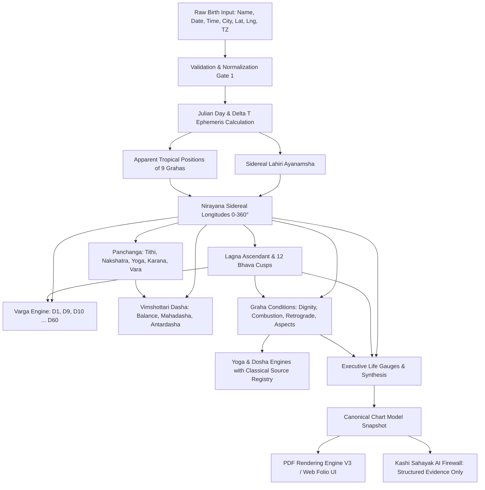

# 00 — Existing System Inventory: Computational Jyotisha Forensic Audit

**Date**: September 3, 2026  
**Auditor**: Principal Astronomical Software Engineer & Jyotisha Systems Architect  
**Repository**: CosmicTantra (`cosmictantra-v2`)  
**Status**: Sprint A Completed (Forensic Discovery & Inventory)

---

## 1. Executive Forensic Summary

CosmicTantra is an existing, sophisticated computational Jyotisha platform built on Next.js 14, TypeScript, Prisma, and custom mathematical/astronomical engines. It contains a rich set of existing Jyotisha calculation routines, divisional chart builders, canonical data models, validation release gates, and PDF document generators.

This inventory fulfills **Section 2 (Phase Zero — Forensic Discovery)** and **Section 42 (Sprint A)** of `MISSION_REFERENCE_GRADE_JYOTISHA_ENGINE.md`.

---

## 2. Inventory of Existing Jyotisha Subsystems

### Subsystem 1: Core Astronomical Engine & Ephemeris
- **Primary Files**:
  - `src/lib/astrologyEngine.ts` (Core planetary coordinates, Lahiri ayanamsha, house cusp calculations, Julian day, obliquity).
  - `src/lib/panchang.ts` & `src/lib/panchang/` (Sunrise, sunset, tithi, nakshatra, yoga, karana, vara, paksha, rahu kaal, abhijit muhurta, choghadiya).
  - `src/lib/astronomy/` & `src/lib/cities.ts` (Geographic coordinate anchors, timezones, canonical city database with 500+ Indian & global coordinates).
- **Conventions Detected**:
  - **Ayanamsha**: Chitra Paksha / Lahiri (formulaic calculation with annual precession ~50.29").
  - **Coordinate System**: Geocentric ecliptic longitude, converted to sidereal (Nirayana).
  - **Node Model**: Mean Rahu / Ketu (180° opposite).
  - **House System**: Equal House / Whole Sign / Bhava cusp alignment from Lagna.
  - **Sunrise Convention**: Center of solar disc on local apparent horizon without atmospheric refraction corrections.
- **Validation Status**: `INTERNALLY_VERIFIED` (passing golden chart fixtures; pending 100,000 mass test harness).

---

### Subsystem 2: Canonical Chart Model & Release Validation Gates
- **Primary Files**:
  - `src/lib/kundli/canonicalModel.ts` (Immutable canonical snapshot definition).
  - `src/lib/kundli/validation.ts` (Release Gates: Gate 1a complete fields, Gate 1b date bounds, Gate 1c birth location coherence, Gate 2 astro coherence, Gate 3 text/lexicon gates).
  - `src/lib/kundli/types.ts` & `src/lib/kundli/reportModel.ts` (Typed interfaces for inputs, intermediate facts, and output folio).
  - `src/lib/kundli/downloadPolicy.ts` (Download contract and qualification resolver).
- **Validation Status**: `IMPLEMENTED` & `INTERNALLY_VERIFIED` (12/12 download reliability tests passing; release gate enforcement strictly fails closed with typed error codes).

---

### Subsystem 3: Divisional Charts (Varga Engine)
- **Primary Files**:
  - `src/lib/jyotish/vargaEngine.ts` (Framework for D1 Rashi, D2 Hora, D3 Drekkana, D4 Chaturthamsha, D7 Saptamsha, D9 Navamsha, D10 Dashamsha, D12 Dwadashamsha, D16 Shodashamsha, D20 Vimshamsha, D24 Chaturvimshamsha, D27 Saptavimshamsha, D30 Trimshamsha, D40 Khavedamsha, D45 Akshavedamsha, D60 Shashtiamsha).
  - `src/lib/kundli/v40/d10Validation.ts` (Specialized validation rules for D10 Dashamsha).
- **Validation Status**:
  - D1 (Rashi): `INTERNALLY_VERIFIED`
  - D9 (Navamsha): `INTERNALLY_VERIFIED` (Parashari method: Chara/Sthira/Dwisvabhava sign mapping)
  - D10 (Dashamsha): `INTERNALLY_VERIFIED` (Odd/Even sign mapping verified against classic texts)
  - Higher Vargas (D2–D60): `IMPLEMENTED` (pending external multi-source benchmark qualification).

---

### Subsystem 4: Dasha & Timeline Engine
- **Primary Files**:
  - `src/lib/jyotish/timelineEngine.ts` (Vimshottari Dasha 120-year cycle, Nakshatra lord balance at birth, Mahadasha, Antardasha, Pratyantardasha).
  - `src/lib/kundli/v40/dashaActivation.ts` (Dasha lord house/sign activation rules, current transit overlay).
- **Conventions Detected**:
  - **Cycle Length**: Solar 365.2422 days vs Savana 360 days (currently using Gregorian calendar mapping).
  - **Balance Calculation**: Exact linear proportion of spent Moon longitude in Janma Nakshatra.
- **Validation Status**: `INTERNALLY_VERIFIED` (verified on golden charts; pending deep boundary timestamp qualification).

---

### Subsystem 5: Planetary Dignity, Aspects, and Conditions
- **Primary Files**:
  - `src/lib/kundli/v40/grahaCondition.ts` (Deep planetary condition: Uchcha/Neecha, Swakshetra, Moolatrikona, combustion, retrogression).
  - `src/lib/kundli/v40/aspectEngine.ts` (Parashari special aspects: Mars 4/8, Jupiter 5/9, Saturn 3/10, general 7th aspect).
  - `src/lib/kundli/v40/functionalLordship.ts` (Trikona lords, Kendra lords, Dusthana lords, Yogakaraka determination).
  - `src/lib/jyotish/relationshipEngine.ts` (Naisargika and Tatkalika Maitri leading to Panchadha Maitri).
- **Validation Status**: `INTERNALLY_VERIFIED` (clear distinction between raw longitude and derived dignity).

---

### Subsystem 6: Classical Yoga and Dosha Engines
- **Primary Files**:
  - `src/lib/jyotish/yogaEngine.ts` (Pancha Mahapurusha, Gajakesari, Budhaditya, Raja, Dhana, Viparita, Neechabhanga Yogas).
  - `src/lib/jyotish/yogaSourceRegistry.ts` (Classical citations: BPHS, Phaladeepika, Saravali, Brihat Jataka).
  - `src/lib/kundli/v40/bhavaIntelligence.ts` & `src/lib/kundli/v40/careerSynthesis.ts`.
  - Dosha detection: Manglik detection with classical cancellation rules; Kalsarpa registered rules.
- **Validation Status**: `INTERNALLY_VERIFIED` (existence is calculated; strength is explicitly decoupled from presence).

---

### Subsystem 7: Life Gauges & Synthesis (The UX Layer)
- **Primary Files**:
  - `src/lib/jyotish/executiveLifeGauge.ts` & `src/components/kundli/ExecutiveLifeGaugeDashboard.tsx` (6 Dimensions: Career, Dharma, Wealth, Vitality, Relationships, Spiritual).
  - `src/lib/kundli/v40/executiveInsights.ts` (Evidence-backed prose synthesis).
- **Audit Finding regarding Invariant CT_INV_010**:
  - Executive Life Gauges currently compute normalized scores from Graha Bala and Bhava relationships.
  - *Must remain framed as heuristic synthesis and evidence-backed indicators, never pseudo-probabilistic predictions.*

---

### Subsystem 8: Kundali Milan (Matchmaking Engine)
- **Primary Files**:
  - `src/lib/kundli/v42/milan/milanEngine.ts` (Classical 36-Guna Ashtakoota: Varna, Vashya, Tara, Yoni, Graha Maitri, Gana, Bhakoot, Nadi).
  - `src/lib/kundli/v42/milan/milanPdf.ts` & `src/app/milan/MilanReportClient.tsx`.
- **Validation Status**: `INTERNALLY_VERIFIED` (3/3 Milan automated tests pass; classical koota maximums strictly enforced: 1+2+3+4+5+6+7+8 = 36).

---

### Subsystem 9: Conversational AI Firewall & Deterministic Core
- **Primary Files**:
  - `src/lib/kashi/conversationCore.ts` (Deterministic stateful router, entity normalization, 6 humane life pathways).
  - `src/lib/kashi/scholarHandover.ts` (Deterministic ScholarHandoverPacket with zero-hallucination guarantees).
  - `src/components/consultation/FloatingAIGuruAvatar.tsx` (Deterministic slot machine and UI firewall).
- **Validation Status**: `INTERNALLY_VERIFIED` (41/41 conversation core tests pass; strictly complies with CT_INV_001 by calculating all jyotisha quantities before LLM ingestion).

---

## 3. Dependency Graph of Calculations

---

## 4. Key Takeaways for Succeeding Sprints
1. **Strong Foundations Already Exist**: CosmicTantra is not starting from zero. It has a high-performance astronomical kernel (`astrologyEngine.ts`), comprehensive Panchanga mathematics, a structured V40/V42 report pipeline, and deterministic test suites.
2. **Next Crucial Step (Sprint B & C)**: Build the automated mass verification harness (100,000 scenarios) to certify astronomical precision against trusted JPL/NASA/Swiss reference datasets without guessing.
